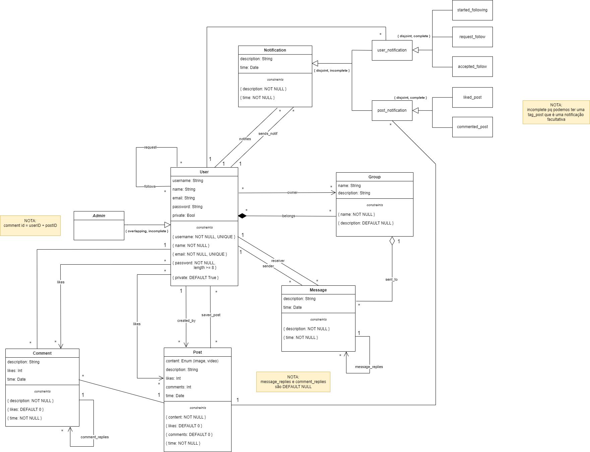

# EBD: Database Specification Component

> **Connecting the World, One Adventure at a Time.**

Travly is a platform designed to unite passionate travelers, allowing them to authentically share their adventures, connect with fellow wanderers and explore the world together.

## A4: Conceptual Data Model

> This section outlines the entities and relationships in the Travly project and sets the foundation for the database specifications. It provides an essential guide for implementing the Travly database, ensuring it meets project requirements effectively.

### 1. Class diagram

> The UML diagram shown illustrates the primary organizational elements, their interconnections, attribute details including their respective domains, and the varying relationship multiplicities within the Travly platform.



### 2. Additional Business Rules
 
> Additional business rules or restrictions that cannot be conveyed in the UML class diagram of Travly’s system.

| Identifier | Description                        |
| ------------------ | ------------------------------------------------ |
| BR21                |  A user can only like a post once. |
| BR22                |  A user can only like a comment once. |
| BR23                |  A user cannot follow itself. |
| BR24                |  A user can only comment on posts from public users or from users they follow. |
| BR25                |  A group owner is also a member of your group. |
| BR26                |  A user cannot request to follow a user that he/she already follow. |
| BR27                |  A user cannot request to follow themselves. |
| BR28                |  When deleting a post it also deletes its comments, subcomments, likes and notifications. |
| BR29                |  When deleting a comment it also deletes its likes, subcomments and notifications. |

---


## A5: Relational Schema, validation and schema refinement

> Within this section, we delve into the relational schema, a result of our meticulous analysis of the conceptual data model. It offers a comprehensive view of each relational schema, featuring their attributes, associated domains, primary keys, foreign keys, and various essential integrity rules such as uniqueness, default values, not null constraints, and checks.


### 1. Relational Schema


| Relation reference | Relation Compact Notation                        |
| ------------------ | ------------------------------------------------ |
| R01                | User(<ins>userID</ins>, username UK NN, name NN, email UK NN, password NN, private NN DF True) |
| R02                | Post(<ins>postID</ins>, content NN, description, likes DF 0, comments DF 0, time NN, created_by->User NN, content_type CK content_type IN post_content_types) |
| R03                | Group(<ins>groupID</ins>, name NN, description) |
| R04                | Message(<ins>messageID</ins>, description NN, time NN, sender->User NN, receiver->User, sent_to->Group, message_replies->Message) |
| R05                | Comment(<ins>commentID</ins>, userID->User NN, postID->Post NN, description NN, likes DF 0, time N, comment_replies->Comment) |
| R06                | Notification(<ins>notificationID</ins>, description NN, time NN, notifies->User NN, sends_notif->User NN) | 
| R07                | Admin(<ins>userID->User</ins>) |
| R08                | Owner(<ins>userID->User</ins>, <ins>groupID->Group</inis>) |
| R09                | Belongs(<ins>userID->User</ins>, <ins>groupID->Group</ins>) |
| R10                | User_Notification(<ins>notificationID->Notification</ins>, userID->User NN, notification_type NN CK notification_type IN user_notification_types) |
| R11                | Post_Notification(<ins>notificationID->Notification</ins>, postID->Post NN, notification_type NN CK notification_type IN post_notification_types) |
| R12                | Request(<ins>senderID->User</ins>, <ins>receiverID->User</ins>) |
| R13                | Follows(<ins>followerID->User</ins>, <ins>followedID->User</ins>) |
| R14                | Post_Likes(<ins>userID->User</ins>, <ins>postID->Post</ins>) |
| R15                | Comment_Likes(<ins>userID->User</ins>, <ins>commentID->Comment</ins>) |
| R16                | Saved_post(<ins>userID->User</ins>, <ins>postID->Post</ins>) |


Legend:

UK = UNIQUE;
NN = NOT NULL;
DF = DEFAULT;
CK = CHECK;


### 2. Domains

> Specification of additional domains.  

| Domain Name | Domain Specification           |
| ----------- | ------------------------------ |
| user_notification_types	      | ENUM('started_following', 'request_follow', 'accepted_follow')      |
| post_notification_types    | ENUM('liked_post', 'commented_post') |
| post_content_types    | ENUM('image', 'video') |

### 3. Schema validation

> We have identified all functional dependencies and successfully achieved the normalization of all relational schemas.  

| **TABLE R01**  | users |
| -------------- | ----- |
| **Keys**       | {id}  |
| **Functional Dependencies:** | None  |
| FD0101         | {id} → {username, name, password, email, private} |
| **NORMAL FORM** | BCNF |

| **TABLE R02**  | Post |
| -------------- | ---- |
| **Keys**       | {postID} |
| **Functional Dependencies:** | None  |
| FD0201         | {postID} → {content, description, likes, comments, time, created_by, content_type} |
| FD0202         | {created_by} → {userID, username, name, password, email, private} |
| **NORMAL FORM** | BCNF |

| **TABLE R03**  | Group |
| -------------- | ----- |
| **Keys**       | {groupID} |
| **Functional Dependencies:** | None  |
| FD0301         | {groupID} → {name, description} |
| **NORMAL FORM** | BCNF |

| **TABLE R04**  | Message |
| -------------- | ------- |
| **Keys**       | {messageID} |
| **Functional Dependencies:** | None  |
| FD0401         | {messageID} → {description, time, sender, receiver, sent_to, message_replies} |
| FD0402         | {sender} → {userID, username, name, password, email, private} |
| FD0403         | {receiver} → {userID, username, name, password, email, private} |
| FD0404         | {sent_to} → {groupID, name, description} |
| FD0405         | {message_replies} → {messageID} |
| **NORMAL FORM** | BCNF |

| **TABLE R05**  | Comment |
| -------------- | ------- |
| **Keys**       | {commentID} |
| **Functional Dependencies:** | None  |
| FD0501         | {commentID} → {description, userID, postID, likes, time, comment_replies} |
| FD0502         | {userID} → {username, name, password, email, private} |
| FD0503         | {postID} → {content, description, likes, comments, time, created_by, content_type} |
| FD0504         | {comment_replies} → {commentID} |
| **NORMAL FORM** | BCNF |

| **TABLE R06**  | Notification |
| -------------- | ------------ |
| **Keys**       | {notificationID} |
| **Functional Dependencies:** | None  |
| FD0601         | {notificationID} → {description, time, notifies, sends_notif} |
| FD0602         | {notifies} → {userID, username, name, password, email, private} |
| FD0603         | {sends_notif} → {userID, username, name, password, email, private} |
| **NORMAL FORM** | BCNF |

| **TABLE R07**  | Admin |
| -------------- | ----- |
| **Keys**       | {userID} |
| **Functional Dependencies:** | None |
| **NORMAL FORM** | BCNF |

| **TABLE R08**  | Owner |
| -------------- | ------ |
| **Keys**       | {userID, groupID} |
| **Functional Dependencies:** | None |
| **NORMAL FORM** | BCNF |

| **TABLE R09**  | Belongs |
| -------------- | ------- |
| **Keys**       | {userID, groupID} |
| **Functional Dependencies:** | None |
| **NORMAL FORM** | BCNF |

| **TABLE R10**  | User_Notification |
| -------------- | ---------------- |
| **Keys**       | {notificationID, userID} |
| **Functional Dependencies:** | None  |
| FD1001         | {notificationID} → {description, time, notifies, sends_notif} |
| FD1002         | {userID} → {username, name, password, email, private} |
| **NORMAL FORM** | BCNF |

| **TABLE R11**  | Post_Notification |
| -------------- | ---------------- |
| **Keys**       | {notificationID, postID} |
| **Functional Dependencies:** | None  |
| FD1101         | {notificationID} → {description, time, notifies, sends_notif} |
| FD1102         | {postID} → {content, description, likes, comments, time, created_by, content_type} |
| **NORMAL FORM** | BCNF |

| **TABLE R12**  | Request |
| -------------- | ------- |
| **Keys**       | {senderID, receiverID} |
| **Functional Dependencies:** | None |
| **NORMAL FORM** | BCNF |

| **TABLE R13**  | Follows |
| -------------- | ------- |
| **Keys**       | {followerID, followedID} |
| **Functional Dependencies:** | None |
| **NORMAL FORM** | BCNF |

| **TABLE R14**  | Post_Likes |
| -------------- | ----- |
| **Keys**       | {userID, postID} |
| **Functional Dependencies:** | None |
| **NORMAL FORM** | BCNF |

| **TABLE R15**  | Comment_Likes |
| -------------- | ----- |
| **Keys**       | {userID, commentID} |
| **Functional Dependencies:** | None |
| **NORMAL FORM** | BCNF |

| **TABLE R16**  | Saved_post |
| -------------- | ---------- |
| **Keys**       | {userID, postID} |
| **Functional Dependencies:** | None |
| **NORMAL FORM** | BCNF |


> Due to the fact that all relationships comply with the Boyce-Codd Normal Form (BCNF), the relational schema is inherently in BCNF, thereby obviating the necessity for any further normalization of the schema.


---


## A6: Indexes, triggers, transactions and database population

> The A6 artifact encompasses the SQL code, which serves as the embodiment of the database's physical schema and its data population. This artifact also encompasses the establishment of data integrity rules through the utilization of triggers, the identification and detailed description of indexes, and the formulation of user-defined functions for the database.

> Additionally, it elaborates on the requisite transactions essential for maintaining data accuracy following interactions and modifications within the database. Furthermore, the document provides an elucidation of the specified isolation level.


### 1. Database Workload
 
> To create a well-designed database, it's crucial to have a clear understanding of how tables will evolve and how frequently they will be accessed. The following table provides these anticipated projections:

| Relation Reference | Relation Name      | Order of Magnitude | Estimated Growth |
|-------------------|--------------------|--------------------|-------------------|
| RS01              | User               | 10,000 (10k)       | 10                |
| RS02              | Post               | 10,000 (10k)       | 1,000 (1k)        |
| RS03              | Group              | 1,000 (1k)         | 10                |
| RS04              | Message            | 100,000 (100k)     | 1,000 (1k)        |
| RS05              | Comment            | 10,000 (10k)       | 100               |
| RS06              | Notification        | 1,000 (1k)         | 1,000 (1k)        |
| RS07              | Admin              | 1                  | 1                 |
| RS08              | Owner              | 1                  | 1                 |
| RS09              | Belongs            | 1                  | 1                 |
| RS10              | User_Notification  | 100                | 100               |
| RS11              | Post_Notification  | 100                | 100               |
| RS12              | Request            | 10                 | 10                |
| RS13              | Follows            | 10                 | 10                |
| RS14              | Post_Likes         | 10,000 (10k)       | 1,000 (1k)        |
| RS15              | Comment_Likes      | 10,000 (10k)       | 1,000 (1k)        |
| RS16              | Saved_post         | 1,000 (1k)         | 100               |


### 2. Proposed Indices

We've harnessed the power of indexes to boost database performance, facilitating swift retrieval of targeted rows. It's worth noting that when an index is created on a column involved in a join operation, it can considerably expedite queries with joins. Additionally, indexes also play a pivotal role in enhancing the efficiency of UPDATE and DELETE operations when they include search conditions.

#### 2.1. Performance Indices
 
> Although SELECT queries have been fine-tuned to achieve faster performance by incorporating performance indexes, it's important to be aware that this optimization could potentially result in somewhat extended execution times for INSERT, UPDATE, and DELETE operations. Nevertheless, the benefits of accelerated search speeds are especially advantageous for certain tables. Below, you'll find a presentation of the performance indexes that have been applied:


| **Index**           | IDX01                                  |
| ---                 | ---                                    |
| **Relation**        | Post   |
| **Attribute**       | created_by   |
| **Type**              |  Hash              |
| **Cardinality**     | Medium |
| **Clustering**      | No               |
| **Justification**   | In a social network, posts play a crucial role, and consequently, the 'Post' table is expected to be extensive. It is common and essential to frequently search for the user associated with each post by performing an exact match on their IDs. Given the low update frequency and medium cardinality, employing hash tables emerges as a favorable solution for optimizing these searches.   |
| `SQL code`              | ↓↓↓↓↓↓↓↓↓↓↓        |

```sql 
CREATE INDEX Author_Post ON Post USING hash (created_by);
```


| **Index**           | IDX02                                  |
| ---                 | ---                                    |
| **Relation**        | Notification    |
| **Attribute**       | notifies   |
| **Type**            | B-tree             |
| **Cardinality**     | Medium |
| **Clustering**      | Yes                |
| **Justification**   |The 'Notification' table is extensive in size. Numerous queries related to notifications in comments, posts, and groups necessitate frequent lookups to identify the notified user. Since these lookups involve exact matches, a hash-type index would be the ideal choice. However, due to our requirement for clustering based on this index, and considering that clustering is not viable with hash-type indexes, we have opted for a B-tree index. With a low update frequency and medium cardinality, the B-tree index is a well-suited candidate for clustering, enhancing the overall efficiency of related queries. |
| `SQL code`               |↓↓↓↓↓↓↓↓↓↓↓|

```sql
CREATE INDEX Notified_User_Notification ON Notification USING btree (notifies);
CLUSTER Notification USING Notified_User_Notification;
```


| **Index**           | IDX03                                  |
| ---                 | ---                                    |
| **Relation**        | Notification    |
| **Attribute**       | send_notif   |
| **Type**            | B-tree             |
| **Cardinality**     | Medium |
| **Clustering**      | Yes                |
| **Justification**   |The 'Notification' table is extensive in size. Numerous queries related to notifications in comments, posts, and groups necessitate frequent identification of the user who made a notification. Since these lookups involve exact matches, a hash-type index would be the ideal choice. However, due to our requirement for clustering based on this index, and considering that clustering is not viable with hash-type indexes, we have opted for a B-tree index. With a low update frequency and medium cardinality, the B-tree index is a well-suited candidate for clustering, enhancing the overall efficiency of related queries.  |
| `SQL code`               |↓↓↓↓↓↓↓↓↓↓↓|

```sql
CREATE INDEX Emitter_User_Notification ON Notification USING btree (send_notif);
CLUSTER Notification USING Emitter_User_Notification;
```


| **Index**           | IDX04                                  |
| ---                 | ---                                    |
| **Relation**        | Comment    |
| **Attribute**       | post_id   |
| **Type**            | B-tree              |
| **Cardinality**     | Medium |
| **Clustering**      | No                |
| **Justification**   | The 'Comment' table is likely to contain a significant amount of data, and there's a common and critical need to retrieve comments associated with a specific post. By optimizing the search operation based on the 'post_id' attribute, this index enhances the overall performance of queries focused on accessing comments within a given post. The medium cardinality of the 'post_id' attribute, along with the infrequent updates to the 'Comment' table, makes the use of a B-tree index a suitable choice for improving the efficiency of comment retrieval operations. |
| `SQL code`               |↓↓↓↓↓↓↓↓↓↓↓|

```sql
CREATE INDEX  Comment_Post ON Comment USING btree(postID);
```


#### 2.2. Full-text Search Indices 

> To enhance text search speed, we have implemented Full-Text Search (FTS) indexes on the tables and attributes that we anticipate will be frequently queried, as dictated by the project's requirements. These indexes can be found within the following specified tables:

| **Index**           | IDX01                                  |
| ---                 | ---                                    |
| **Relation**        | User                                   |
| **Attribute**       | username, name                         |
| **Type**            | GIN                                    |
| **Clustering**      | No                |
| **Justification**   | To provide full-text search features to look for users based on matching usernames and names.   |
| `SQL code`                                                  |↓↓↓↓↓↓↓↓↓↓↓|

```sql
ALTER TABLE "User"
ADD COLUMN user_tsvectors TSVECTOR;

CREATE OR REPLACE FUNCTION user_search_update() RETURNS TRIGGER AS $$
BEGIN
 IF TG_OP = 'INSERT' THEN
        NEW.user_tsvectors = (
         setweight(to_tsvector('english', NEW.username), 'A') ||
         setweight(to_tsvector('english', NEW.name), 'B')
        );
 END IF;
 IF TG_OP = 'UPDATE' THEN
         IF (NEW.username <> OLD.username OR NEW.name <> OLD.name) THEN
           NEW.user_tsvectors = (
             setweight(to_tsvector('english', NEW.username), 'A') ||
             setweight(to_tsvector('english', NEW.name), 'B')
           );
         END IF;
 END IF;
 RETURN NEW;
END $$
LANGUAGE plpgsql;

CREATE TRIGGER user_search_update
 BEFORE INSERT OR UPDATE ON "User"
 FOR EACH ROW
 EXECUTE FUNCTION user_search_update();

CREATE INDEX user_search_idx ON "User" USING GIN (user_tsvectors);
```


| **Index**           | IDX02                                  |
| ---                 | ---                                    |
| **Relation**        | Group    |
| **Attribute**       | name, description   |
| **Type**            | GIN              |
| **Clustering**      | No                |
| **Justification**   | To provide full-text search features to look for groups based on matching group names and descriptions.   |
| `SQL code`                                                  |↓↓↓↓↓↓↓↓↓↓↓|

```sql
ALTER TABLE "Group"
ADD COLUMN group_tsvectors TSVECTOR;

CREATE OR REPLACE FUNCTION group_search_update() RETURNS TRIGGER AS $$
BEGIN
 IF TG_OP = 'INSERT' THEN
        NEW.group_tsvectors = (
         setweight(to_tsvector('english', NEW.name), 'A') ||
         setweight(to_tsvector('english', NEW.description), 'B')
        );
 END IF;
 IF TG_OP = 'UPDATE' THEN
         IF (NEW.name <> OLD.name OR NEW.description <> OLD.description) THEN
           NEW.group_tsvectors = (
             setweight(to_tsvector('english', NEW.name), 'A') ||
             setweight(to_tsvector('english', NEW.description), 'B')
           );
         END IF;
 END IF;
 RETURN NEW;
END $$
LANGUAGE plpgsql;


CREATE TRIGGER group_search_update
 BEFORE INSERT OR UPDATE ON "Group"
 FOR EACH ROW
 EXECUTE FUNCTION group_search_update();

CREATE INDEX group_search_idx ON "Group" USING GIN (group_tsvectors);~
```

| **Index**           | IDX03                                  |
| ---                 | ---                                    |
| **Relation**        | Post    |
| **Attribute**       | content, description   |
| **Type**            | GIN              |
| **Clustering**      | No                |
| **Justification**   | To provide full-text search features to look for posts based on matching post content and descriptions.   |
| `SQL code`                                                  |↓↓↓↓↓↓↓↓↓↓↓|

```sql
ALTER TABLE "Post"
ADD COLUMN post_tsvectors TSVECTOR;


CREATE OR REPLACE FUNCTION post_search_update() RETURNS TRIGGER AS $$
BEGIN
 IF TG_OP = 'INSERT' THEN
        NEW.post_tsvectors = (
         setweight(to_tsvector('english', NEW.content), 'A') ||
         setweight(to_tsvector('english', NEW.description), 'B')
        );
 END IF;
 IF TG_OP = 'UPDATE' THEN
         IF (NEW.content <> OLD.content OR NEW.description <> OLD.description) THEN
           NEW.post_tsvectors = (
             setweight(to_tsvector('english', NEW.content), 'A') ||
             setweight(to_tsvector('english', NEW.description), 'B')
           );
         END IF;
 END IF;
 RETURN NEW;
END $$
LANGUAGE plpgsql;

CREATE TRIGGER post_search_update
 BEFORE INSERT OR UPDATE ON "Post"
 FOR EACH ROW
 EXECUTE FUNCTION post_search_update();

CREATE INDEX post_search_idx ON "Post" USING GIN (post_tsvectors);
```

| **Index**           | IDX04                                  |
| ---                 | ---                                    |
| **Relation**        | Message    |
| **Attribute**       | description   |
| **Type**            | GIN              |
| **Clustering**      | No                |
| **Justification**   | To provide full-text search features to look for messages based on matching message descriptions.   |
| `SQL code`                                                  |↓↓↓↓↓↓↓↓↓↓↓|

```sql
ALTER TABLE "Message"
ADD COLUMN message_tsvectors TSVECTOR;

CREATE OR REPLACE FUNCTION message_search_update() RETURNS TRIGGER AS $$
BEGIN
 IF TG_OP = 'INSERT' THEN
        NEW.message_tsvectors = setweight(to_tsvector('english', NEW.description), 'A');
 END IF;
 IF TG_OP = 'UPDATE' THEN
         IF (NEW.description <> OLD.description) THEN
           NEW.message_tsvectors = setweight(to_tsvector('english', NEW.description), 'A');
         END IF;
 END IF;
 RETURN NEW;
END $$
LANGUAGE plpgsql;

CREATE TRIGGER message_search_update
 BEFORE INSERT OR UPDATE ON "Message"
 FOR EACH ROW
 EXECUTE FUNCTION message_search_update();

CREATE INDEX message_search_idx ON "Message" USING GIN (message_tsvectors);
```

| **Index**           | IDX05                                  |
| ---                 | ---                                    |
| **Relation**        | Comment    |
| **Attribute**       | description   |
| **Type**            | GIN              |
| **Clustering**      | No               |
| **Justification**   | To provide full-text search features to look for comments based on matching comment descriptions.   |
| `SQL code`                                                  |↓↓↓↓↓↓↓↓↓↓↓|

```sql

ALTER TABLE "Comment"
ADD COLUMN comment_tsvectors TSVECTOR;

CREATE OR REPLACE FUNCTION comment_search_update() RETURNS TRIGGER AS $$
BEGIN
 IF TG_OP = 'INSERT' THEN
        NEW.comment_tsvectors = setweight(to_tsvector('english', NEW.description), 'A');
 END IF;
 IF TG_OP = 'UPDATE' THEN
         IF (NEW.description <> OLD.description) THEN
           NEW.comment_tsvectors = setweight(to_tsvector('english', NEW.description), 'A');
         END IF;
 END IF;
 RETURN NEW;
END $$
LANGUAGE plpgsql;

CREATE TRIGGER comment_search_update
 BEFORE INSERT OR UPDATE ON "Comment"
 FOR EACH ROW
 EXECUTE FUNCTION comment_search_update();

CREATE INDEX comment_search_idx ON "Comment" USING GIN (comment_tsvectors);
```


### 3. Triggers
 
> User-defined functions and trigger procedures that add control structures to the SQL language or perform complex computations, are identified and described to be trusted by the database server. Every kind of function (SQL functions, Stored procedures, Trigger procedures) can take base types, composite types, or combinations of these as arguments (parameters). In addition, every kind of function can return a base type or a composite type. Functions can also be defined to return sets of base or composite values.  


| **Trigger**      | TRIGGER01                             |
| ---              | ---                                    |
| **Description**  |A user cannot like his/her own posts (business rule BR10).|
| `SQL code`    |  ↓↓↓↓↓↓↓↓↓↓↓|

```CREATE FUNCTION verify_self_liking_post() RETURNS TRIGGER AS 

$BODY$

BEGIN

IF EXISTS (SELECT * FROM post_ WHERE NEW.postID = post_.postID AND NEW.userID = post_.created_by) 

THEN RAISE EXCEPTION 'A user cannot like his/her own posts';

END IF;

RETURN NEW;

END 

$BODY$

LANGUAGE plpgsql;

CREATE TRIGGER verify_self_liking_post

BEFORE INSERT OR UPDATE ON post_likes

FOR EACH ROW

EXECUTE PROCEDURE verify_self_liking_post();

```

| **Trigger**      | TRIGGER02                             |
| ---              | ---                                    |
| **Description**  |A user cannot like his/her own comments (business rule BR10).|
| `SQL code`    |  ↓↓↓↓↓↓↓↓↓↓↓|

```CREATE FUNCTION verify_self_liking_comment() RETURNS TRIGGER AS 

$BODY$

BEGIN

IF EXISTS (SELECT * FROM comment_ WHERE NEW.commentID = comment_.commentID AND NEW.userID = comment_.userID) 

THEN RAISE EXCEPTION 'A user cannot like his/her own comments';

END IF;

RETURN NEW;

END 

$BODY$

LANGUAGE plpgsql;

CREATE TRIGGER verify_self_liking_comment

BEFORE INSERT OR UPDATE ON comment_likes

FOR EACH ROW

EXECUTE PROCEDURE verify_self_liking_comment();

```

| **Trigger**      | TRIGGER03                              |
| ---              | ---                                    |
| **Description**  | A user can only like a post once (business rule BR21). |
| `SQL code`    |   ↓↓↓↓↓↓↓↓↓↓↓|
```CREATE FUNCTION verify_post_likes() RETURNS TRIGGER AS

$BODY$

BEGIN

IF EXISTS (SELECT * FROM post_likes WHERE NEW.userID = post_likes.userID AND NEW.postID = post_likes.postID) 

THEN RAISE EXCEPTION 'A user can only like a post once';

END IF;

RETURN NEW;

END

$BODY$

LANGUAGE plpgsql;

CREATE TRIGGER verify_post_likes

BEFORE INSERT OR UPDATE ON post_likes

FOR EACH ROW

EXECUTE PROCEDURE verify_post_likes();

```


| **Trigger**      | TRIGGER04                             |
| ---              | ---                                    |
| **Description**  | A user can only like a comment once (business rule BR22). |
| `SQL code`    |   ↓↓↓↓↓↓↓↓↓↓↓|
```CREATE FUNCTION verify_comment_likes() RETURNS TRIGGER AS

$BODY$

BEGIN

IF EXISTS (SELECT * FROM comment_likes WHERE NEW.userID = userID AND NEW.postID = postID) 

THEN RAISE EXCEPTION 'A user can only like a comment once';

END IF;

RETURN NEW;

END

$BODY$

LANGUAGE plpgsql;

CREATE TRIGGER verify_comment_likes

BEFORE INSERT OR UPDATE ON comment_likes

FOR EACH ROW

EXECUTE PROCEDURE verify_comment_likes();

```


| **Trigger**      | TRIGGER05                             |
| ---              | ---                                    |
| **Description**  | A user cannot follow itself (business rule BR23).|
| `SQL code`    |   ↓↓↓↓↓↓↓↓↓↓↓|
```CREATE FUNCTION verify_self_follow() RETURNS TRIGGER AS

$BODY$

BEGIN

IF NEW.followerID = NEW.followedID 

THEN RAISE EXCEPTION 'A user cannot follow itself';

END IF;

RETURN NEW;

END

$BODY$

LANGUAGE plpgsql;

CREATE TRIGGER verify_self_follow

BEFORE INSERT OR UPDATE ON follows

FOR EACH ROW

EXECUTE PROCEDURE verify_self_follow();

```


| **Trigger**      | TRIGGER06                             |
| ---              | ---                                    |
| **Description**  | A user can only comment on posts from public users or users they follow (business rule BR24).|
| `SQL code`    |   ↓↓↓↓↓↓↓↓↓↓↓|
```CREATE FUNCTION verify_comment() RETURNS TRIGGER AS

$BODY$

BEGIN

IF EXISTS (SELECT * FROM user_, post_ WHERE NEW.postID = post_.postID AND post_.created_by = user_userID AND user_.private_ )

AND NOT EXISTS (SELECT * FROM post_,follows_ WHERE NEW.postID = post_.postID AND NEW.userID = follows_.followerID AND follows_.followedID = post_.created_by) 

THEN RAISE EXCEPTION 'A user can only comment on posts from public users or users they follow';

END IF;

RETURN NEW;

END

$BODY$

LANGUAGE plpgsql;

CREATE TRIGGER verify_comment

BEFORE INSERT OR UPDATE ON comment_

FOR EACH ROW

EXECUTE PROCEDURE verify_comment();

```

| **Trigger**      | TRIGGER07                             |
| ---              | ---                                    |
| **Description**  | A group owner is also a member of your group (business rule BR25).|
| `SQL code`    |   ↓↓↓↓↓↓↓↓↓↓↓|
```CREATE FUNCTION group_owner() RETURNS TRIGGER AS

$BODY$

BEGIN

IF NOT EXISTS ( SELECT  * FROM belongs_ WHERE NEW.userID = belongs_.userID AND NEW.groupID = belongs_.groupID) 
	
THEN RAISE EXCEPTION 'A group owner is also be a member of the group';
    
END IF;

RETURN NEW;

END;

$BODY$

LANGUAGE plpgsql;

CREATE TRIGGER group_owner

BEFORE INSERT OR UPDATE ON owner_

FOR EACH ROW

EXECUTE PROCEDURE group_owner();

```


| **Trigger**      | TRIGGER08                             |
| ---              | ---                                    |
| **Description**  | A user cannot request to follow a user that he/she already follow (business rule BR26).|
| `SQL code`    |  ↓↓↓↓↓↓↓↓↓↓↓|
```CREATE FUNCTION check_follow_request() RETURNS TRIGGER AS

$BODY$

BEGIN

IF EXISTS (SELECT * FROM follows_ WHERE NEW.senderID = follows_.followerID AND NEW.receiverID = follows_.followedID)

THEN RAISE EXCEPTION 'A user cannot request to follow a user that he/she already follow';

END IF;

RETURN NEW;

END;

$BODY$

LANGUAGE plpgsql;

CREATE TRIGGER check_follow_request

BEFORE INSERT ON follows_

FOR EACH ROW

EXECUTE PROCEDURE check_follow_request();

```

| **Trigger**      | TRIGGER09                             |
| ---              | ---                                    |
| **Description**  | A user cannot request to follow themselves (business rule BR27).|
| `SQL code`    |  ↓↓↓↓↓↓↓↓↓↓↓|
```CREATE FUNCTION verify_self_follow_req() RETURNS TRIGGER AS

$BODY$

BEGIN

IF NEW.senderID = NEW.receiverID THEN

RAISE EXCEPTION 'A user cannot request to follow themselves';

END IF;

RETURN NEW;

END

$BODY$

LANGUAGE plpgsql;

CREATE TRIGGER verify_self_follow_req

BEFORE INSERT OR UPDATE ON follows_

FOR EACH ROW

EXECUTE PROCEDURE verify_self_follow_req();

```

| **Trigger**      | TRIGGER10                             |
| ---              | ---                                    |
| **Description**  |When deleting a post it also deletes its comments, subcomments, likes and notifications (business rule BR28).|
| `SQL code`    |  ↓↓↓↓↓↓↓↓↓↓↓|
```CREATE FUNCTION delete_post_action() RETURNS TRIGGER AS

$BODY$

BEGIN

DELETE FROM post_likes WHERE OLD.postID = post_likes.postID;

DELETE FROM Post_Notification WHERE OLD.postID = Post_Notification.postID;

DELETE FROM comment_ WHERE OLD.postID IN (SELECT postID FROM comment_ WHERE OLD.postID = comment_.postID OR OLD.postID = comment_.commentID);

RETURN OLD;

END;

$BODY$

LANGUAGE plpgsql;

CREATE TRIGGER delete_post_action

BEFORE INSERT ON post_

FOR EACH ROW

EXECUTE PROCEDURE delete_post_action();

```

| **Trigger**      | TRIGGER11                             |
| ---              | ---                                    |
| **Description**  |When deleting a comment it also deletes its likes, subcomments and notifications (business rule BR29).|
| `SQL code`    |  ↓↓↓↓↓↓↓↓↓↓↓|
```CREATE FUNCTION delete_comment_action() RETURNS TRIGGER AS

$BODY$

BEGIN

DELETE FROM comment_likes WHERE OLD.commentID = comment_likes.commentID;

DELETE FROM Post_Notification WHERE OLD.commentID = Post_Notification.commentID;

DELETE FROM comment_ WHERE OLD.commentID = comment_.commentID;

RETURN OLD;

END;

$BODY$

LANGUAGE plpgsql;

CREATE TRIGGER delete_comment_action

BEFORE INSERT ON comment_

FOR EACH ROW

EXECUTE PROCEDURE delete_comment_action();

```

### 4. Transactions
 
> To ensure data integrity when performing multiple operations, we utilize the following transactions.

| SQL Reference   | Delete user                    |
| --------------- | ----------------------------------- |
| Justification   | The isolation level is set to Repeatable Read to prevent any potential updates to the notification table caused by a deletion in various tables carried out by a concurrent transaction. This choice is made to ensure data consistency and avoid the storage of inconsistent data.  |
| Isolation level | REPEATABLE READ |
| `SQL Code`                                   |↓↓↓↓↓↓↓↓↓↓↓|

```sql
SET TRANSACTION ISOLATION LEVEL REPEATABLE READ;

BEGIN;

DELETE FROM User_Notification
WHERE userID = 'ID_do_utilizador';

DELETE FROM Post_Notification
WHERE postID IN (SELECT postID FROM post_ WHERE created_by = 'ID_do_utilizador');

DELETE FROM request_
WHERE senderID = 'ID_do_utilizador' OR receiverID = 'ID_do_utilizador';

DELETE FROM follows_
WHERE followerID = 'ID_do_utilizador' OR followedID = 'ID_do_utilizador';

DELETE FROM post_likes
WHERE userID = 'ID_do_utilizador';

DELETE FROM comment_likes
WHERE userID = 'ID_do_utilizador';

DELETE FROM comment_
WHERE userID = 'ID_do_utilizador';

DELETE FROM message_
WHERE sender = 'ID_do_utilizador';

UPDATE message_
SET receiver = NULL
WHERE receiver = 'ID_do_utilizador';

DELETE FROM belongs_
WHERE userID = 'ID_do_utilizador';

DELETE FROM owner_
WHERE userID = 'ID_do_utilizador';

DELETE FROM group_
WHERE ownerID = 'ID_do_utilizador';

DELETE FROM user_
WHERE userID = 'ID_do_utilizador';

COMMIT;

```
| SQL Reference             | Create New Group                                           |
| ------------------------- | ---------------------------------------------------------- |
| Justification        | The Repeatable Read isolation level is employed to maintain data consistency during the creation of a new group, preventing any concurrent updates to the notification and group tables. |
| Isolation level      | REPEATABLE READ                                            |
| SQL Code             |          |

```sql
BEGIN;

INSERT INTO group_ (name_, description_)
VALUES ('Novo Nome do Grupo', 'Descrição do Grupo');

DECLARE @newGroupID INT;
SET @newGroupID = SCOPE_IDENTITY();

INSERT INTO owner_ (userID, groupID)
VALUES (<owner_user_id>, @newGroupID);

INSERT INTO belongs_ (userID, groupID)
VALUES (<user_id>, @newGroupID);

COMMIT;

```                                              

| SQL Reference   | New comment notification                    |
| --------------- | ----------------------------------- |
| Justification   | The choice of the Repeatable Read isolation level is essential because without it, there is a risk of an update occurring in the notification table due to an insert operation in the post_notification table committed by a concurrent transaction. This would lead to the storage of inconsistent data.  |
| Isolation level | REPEATABLE READ |
| `SQL Code`                                   |↓↓↓↓↓↓↓↓↓↓↓|

```sql

BEGIN;

INSERT INTO notification_ (description_, time, notifies, sends_notif)
VALUES ('Nova notificação de comentário em post', NOW(), (SELECT userID FROM user_ WHERE username = 'username_do_proprietario_do_post'), (SELECT userID FROM user_ WHERE username = 'username_do_utilizador_autenticado'));

DECLARE newNotificationID INT;
SET newNotificationID = LAST_INSERT_ID();

INSERT INTO comment_ (notificationID, postID, description_, likes, time, comment_replies)
VALUES (newNotificationID, 'ID_do_post', 'Descrição do comentário', 0, NOW(), NULL);

COMMIT;
```


| SQL Reference   | Like post notification                    |
| --------------- | ----------------------------------- |
| Justification   | The selection of the Repeatable Read isolation level is imperative to mitigate the risk of an update occurring in the notification table due to an insert operation in the post_notification table committed by a concurrent transaction. This safeguards data consistency and prevents the storage of inconsistent information.  |
| Isolation level | REPEATABLE READ |
| `SQL Code`                                   |↓↓↓↓↓↓↓↓↓↓↓|

```sql

SET TRANSACTION ISOLATION LEVEL REPEATABLE READ;

IF EXISTS (SELECT 1 FROM post_likes WHERE userID = 'ID_do_utilizador_autenticado' AND postID = 'ID_do_post') THEN
    RETURN;
END IF;

INSERT INTO post_likes (userID, postID)
VALUES ('ID_do_utilizador_autenticado', 'ID_do_post');

IF 'ID_do_utilizador_autenticado' = 'ID_do_proprietario_do_post' THEN
    RETURN;
END IF;

BEGIN;

INSERT INTO notification_ (description_, time, notifies, sends_notif)
VALUES ('Nova notificação de "like" em post', NOW(), 'ID_do_proprietario_do_post', 'ID_do_utilizador_autenticado');

SELECT notificationID
FROM notification_
WHERE notifies = 'ID_do_proprietario_do_post' 
  AND sends_notif = 'ID_do_utilizador_autenticado'
ORDER BY time DESC
LIMIT 1;

INSERT INTO Post_Notification (notificationID, postID, notification_type)
VALUES ('ID_da_notificacao_obtido_anteriormente', 'ID_do_post', 'liked_post');

COMMIT;

```


| SQL Reference   | Follow notification                    |
| --------------- | ----------------------------------- |
| Justification   | The adoption of the Repeatable Read isolation level is necessary to prevent the occurrence of an update in the notification table, which could result from an insert operation in the user_notification table committed by a concurrent transaction. This measure ensures the maintenance of data consistency and avoids the storage of inconsistent information.  |
| Isolation level | REPEATABLE READ |
| `SQL Code`                                   |↓↓↓↓↓↓↓↓↓↓↓|

```sql

SET TRANSACTION ISOLATION LEVEL REPEATABLE READ;

BEGIN;

INSERT INTO follows_ (followerID, followedID)
VALUES ('ID_do_utilizador_autenticado', 'ID_do_utilizador_seguido');

INSERT INTO notification_ (description_, time, notifies, sends_notif)
VALUES ('Nova notificação de seguidor', NOW(), 'ID_do_utilizador_seguido', 'ID_do_utilizador_autenticado');

SELECT notificationID
FROM notification_
WHERE notifies = 'ID_do_utilizador_seguido'
  AND sends_notif = 'ID_do_utilizador_autenticado'
ORDER BY time DESC
LIMIT 1;

INSERT INTO User_Notification (notificationID, notification_type)
VALUES ('ID_da_notificacao_obtida_anteriormente', 'started_following');

COMMIT;

```


## Annex A. SQL Code

Travly Database Schema is available in Annexes and in the main code repository.

Travly Database population is available in Annexes and in the main code repository.

### A.1. Database schema

```php
--====================================--
--          Drop old schema           --
--====================================--

DROP TABLE IF EXISTS user_ CASCADE;
DROP TABLE IF EXISTS post_ CASCADE;
DROP TABLE IF EXISTS group_ CASCADE;
DROP TABLE IF EXISTS message_ CASCADE;
DROP TABLE IF EXISTS comment_ CASCADE;
DROP TABLE IF EXISTS notification_ CASCADE;
DROP TABLE IF EXISTS admin_ CASCADE;
DROP TABLE IF EXISTS owner_ CASCADE;
DROP TABLE IF EXISTS belongs_ CASCADE;
DROP TABLE IF EXISTS user_notifications CASCADE;
DROP TABLE IF EXISTS post_notifications CASCADE;
DROP TABLE IF EXISTS request_ CASCADE;
DROP TABLE IF EXISTS follows_ CASCADE;
DROP TABLE IF EXISTS post_likes CASCADE;
DROP TABLE IF EXISTS comment_likes CASCADE;
DROP TABLE IF EXISTS saved_post CASCADE;

DROP TYPE IF EXISTS post_content_types;
DROP TYPE IF EXISTS user_notification_types;
DROP TYPE IF EXISTS post_content_types;

--====================================--
--               Types                --
--====================================--

CREATE TYPE post_content_types AS ENUM ('image', 'video');
CREATE TYPE user_notification_types AS ENUM ('started_following', 'request_follow', 'accepted_follow');
CREATE TYPE post_notification_types AS ENUM ('liked_post', 'commented_post');

--====================================--
--               Tables               --
--====================================--

CREATE TABLE user_ (
    userID SERIAL PRIMARY KEY,
    username TEXT UNIQUE NOT NULL,
    name TEXT NOT NULL,
    email TEXT UNIQUE NOT NULL,
    password_ TEXT NOT NULL,
    private_ BOOLEAN NOT NULL DEFAULT TRUE
);

CREATE TABLE post_ (
    postID SERIAL PRIMARY KEY,
    content TEXT NOT NULL, 
    description_ TEXT,
    likes_ INTEGER DEFAULT 0,
    comments INTEGER DEFAULT 0, 
    time_ INTEGER NOT NULL,
    created_by INTEGER NOT NULL REFERENCES user_ (userID) ON UPDATE CASCADE,
    content_type post_content_types
);

CREATE TABLE group_ (
    groupID SERIAL PRIMARY KEY, 
    name_ TEXT NOT NULL, 
    description_ TEXT DEFAULT NULL
);

CREATE TABLE message_ (
    messageID SERIAL PRIMARY KEY, 
    description_ TEXT NOT NULL, 
    time_ INTEGER NOT NULL, 
    sender INTEGER NOT NULL REFERENCES user_ (userID) ON UPDATE CASCADE, 
    receiver INTEGER REFERENCES user_ (userID) ON UPDATE CASCADE, 
    sent_to INTEGER REFERENCES group_ (groupID) ON UPDATE CASCADE, 
    message_replies INTEGER DEFAULT NULL REFERENCES message_ (messageID) ON UPDATE CASCADE 
);

CREATE TABLE comment_ (
    commentID SERIAL PRIMARY KEY, 
    description_ TEXT NOT NULL,
    likes_ INTEGER DEFAULT 0, 
    time_ INTEGER NOT NULL,
    userID INTEGER NOT NULL REFERENCES user_ (userID) ON UPDATE CASCADE,
    postID INTEGER NOT NULL REFERENCES post_ (postID) ON UPDATE CASCADE,
    comment_replies INTEGER DEFAULT NULL REFERENCES comment_ (commentID) ON UPDATE CASCADE 
);

CREATE TABLE notification_ (
    notificationID SERIAL PRIMARY KEY,
    description_ TEXT NOT NULL, 
    time_ INTEGER NOT NULL,
    notifies INTEGER NOT NULL REFERENCES user_ (userID),
    sends_notif INTEGER NOT NULL REFERENCES user_ (userID)
);

CREATE TABLE admin_ (
    userID INTEGER PRIMARY KEY REFERENCES user_ (userID) ON UPDATE CASCADE
);

CREATE TABLE owner_ (
    userID INTEGER REFERENCES user_ (userID) ON UPDATE CASCADE,
    groupID INTEGER REFERENCES group_ (groupID) ON UPDATE CASCADE,
    PRIMARY KEY (userID, groupID)
);

CREATE TABLE belongs_ (
    userID INTEGER REFERENCES user_ (userID) ON UPDATE CASCADE,
    groupID INTEGER REFERENCES group_ (groupID) ON UPDATE CASCADE,
    PRIMARY KEY (userID, groupID)
);

CREATE TABLE User_Notification(
    notificationID INTEGER PRIMARY KEY REFERENCES notification_ (notificationID) ON UPDATE CASCADE,
    userID INTEGER NOT NULL REFERENCES user_ (userID), 
    notification_type user_notification_types NOT NULL
);

CREATE TABLE Post_Notification(
    notificationID INTEGER PRIMARY KEY REFERENCES notification_ (notificationID) ON UPDATE CASCADE,
    postID INTEGER NOT NULL REFERENCES post_ (postID) ON UPDATE CASCADE, 
    notification_type post_notification_types NOT NULL
);

CREATE TABLE request_(
    senderID INTEGER REFERENCES user_ (userID) ON UPDATE CASCADE,
    receiverID INTEGER REFERENCES user_ (userID) ON UPDATE CASCADE,
    PRIMARY KEY (senderID, receiverID)
);

CREATE TABLE follows_(
    followerID INTEGER REFERENCES user_ (userID) ON UPDATE CASCADE,
    followedID INTEGER REFERENCES user_ (userID) ON UPDATE CASCADE,
    PRIMARY KEY (followerID, followedID)
);

CREATE TABLE post_likes(
    userID INTEGER REFERENCES user_ (userID) ON UPDATE CASCADE,
    postID INTEGER REFERENCES post_ (postID) ON UPDATE CASCADE,
    PRIMARY KEY (userID, postID)
);

CREATE TABLE comment_likes(
    userID INTEGER REFERENCES user_ (userID) ON UPDATE CASCADE,
    commentID INTEGER REFERENCES comment_ (commentID) ON UPDATE CASCADE,
    PRIMARY KEY (userID, commentID)
);

CREATE TABLE saved_post(
    userID INTEGER REFERENCES user_ (userID) ON UPDATE CASCADE,
    postID INTEGER REFERENCES post_ (postID) ON UPDATE CASCADE,
    PRIMARY KEY (userID, postID)
);

-----------------------------------------
-- INDEXES
-----------------------------------------

-IDX01
CREATE INDEX Author_Post ON Post USING hash (created_by);

--IDX02
CREATE INDEX Notified_User_Notification ON Notification USING btree (notifies);
CLUSTER Notification USING Notified_User_Notification;

--IDX03
CREATE INDEX Emitter_User_Notification ON Notification USING btree (send_notif);
CLUSTER Notification USING Emitter_User_Notification;

--ID04
CREATE INDEX  Comment_Post ON Comment USING btree(postID);

-----------------------------------------
-- FTS INDEXES
-----------------------------------------
--User
ALTER TABLE "User"
ADD COLUMN user_tsvectors TSVECTOR;

CREATE OR REPLACE FUNCTION user_search_update() RETURNS TRIGGER AS $$
BEGIN
 IF TG_OP = 'INSERT' THEN
        NEW.user_tsvectors = (
         setweight(to_tsvector('english', NEW.username), 'A') ||
         setweight(to_tsvector('english', NEW.name), 'B')
        );
 END IF;
 IF TG_OP = 'UPDATE' THEN
         IF (NEW.username <> OLD.username OR NEW.name <> OLD.name) THEN
           NEW.user_tsvectors = (
             setweight(to_tsvector('english', NEW.username), 'A') ||
             setweight(to_tsvector('english', NEW.name), 'B')
           );
         END IF;
 END IF;
 RETURN NEW;
END $$
LANGUAGE plpgsql;

CREATE TRIGGER user_search_update
 BEFORE INSERT OR UPDATE ON "User"
 FOR EACH ROW
 EXECUTE FUNCTION user_search_update();

CREATE INDEX user_search_idx ON "User" USING GIN (user_tsvectors);

--Group

ALTER TABLE "Group"
ADD COLUMN group_tsvectors TSVECTOR;

CREATE OR REPLACE FUNCTION group_search_update() RETURNS TRIGGER AS $$
BEGIN
 IF TG_OP = 'INSERT' THEN
        NEW.group_tsvectors = (
         setweight(to_tsvector('english', NEW.name), 'A') ||
         setweight(to_tsvector('english', NEW.description), 'B')
        );
 END IF;
 IF TG_OP = 'UPDATE' THEN
         IF (NEW.name <> OLD.name OR NEW.description <> OLD.description) THEN
           NEW.group_tsvectors = (
             setweight(to_tsvector('english', NEW.name), 'A') ||
             setweight(to_tsvector('english', NEW.description), 'B')
           );
         END IF;
 END IF;
 RETURN NEW;
END $$
LANGUAGE plpgsql;


CREATE TRIGGER group_search_update
 BEFORE INSERT OR UPDATE ON "Group"
 FOR EACH ROW
 EXECUTE FUNCTION group_search_update();

CREATE INDEX group_search_idx ON "Group" USING GIN (group_tsvectors);

-Post

ALTER TABLE "Post"
ADD COLUMN post_tsvectors TSVECTOR;


CREATE OR REPLACE FUNCTION post_search_update() RETURNS TRIGGER AS $$
BEGIN
 IF TG_OP = 'INSERT' THEN
        NEW.post_tsvectors = (
         setweight(to_tsvector('english', NEW.content), 'A') ||
         setweight(to_tsvector('english', NEW.description), 'B')
        );
 END IF;
 IF TG_OP = 'UPDATE' THEN
         IF (NEW.content <> OLD.content OR NEW.description <> OLD.description) THEN
           NEW.post_tsvectors = (
             setweight(to_tsvector('english', NEW.content), 'A') ||
             setweight(to_tsvector('english', NEW.description), 'B')
           );
         END IF;
 END IF;
 RETURN NEW;
END $$
LANGUAGE plpgsql;

CREATE TRIGGER post_search_update
 BEFORE INSERT OR UPDATE ON "Post"
 FOR EACH ROW
 EXECUTE FUNCTION post_search_update();

CREATE INDEX post_search_idx ON "Post" USING GIN (post_tsvectors);


- Message

ALTER TABLE "Message"
ADD COLUMN message_tsvectors TSVECTOR;

CREATE OR REPLACE FUNCTION message_search_update() RETURNS TRIGGER AS $$
BEGIN
 IF TG_OP = 'INSERT' THEN
        NEW.message_tsvectors = setweight(to_tsvector('english', NEW.description), 'A');
 END IF;
 IF TG_OP = 'UPDATE' THEN
         IF (NEW.description <> OLD.description) THEN
           NEW.message_tsvectors = setweight(to_tsvector('english', NEW.description), 'A');
         END IF;
 END IF;
 RETURN NEW;
END $$
LANGUAGE plpgsql;

CREATE TRIGGER message_search_update
 BEFORE INSERT OR UPDATE ON "Message"
 FOR EACH ROW
 EXECUTE FUNCTION message_search_update();

CREATE INDEX message_search_idx ON "Message" USING GIN (message_tsvectors);

-Comment
ALTER TABLE "Comment"
ADD COLUMN comment_tsvectors TSVECTOR;

CREATE OR REPLACE FUNCTION comment_search_update() RETURNS TRIGGER AS $$
BEGIN
 IF TG_OP = 'INSERT' THEN
        NEW.comment_tsvectors = setweight(to_tsvector('english', NEW.description), 'A');
 END IF;
 IF TG_OP = 'UPDATE' THEN
         IF (NEW.description <> OLD.description) THEN
           NEW.comment_tsvectors = setweight(to_tsvector('english', NEW.description), 'A');
         END IF;
 END IF;
 RETURN NEW;
END $$
LANGUAGE plpgsql;

CREATE TRIGGER comment_search_update
 BEFORE INSERT OR UPDATE ON "Comment"
 FOR EACH ROW
 EXECUTE FUNCTION comment_search_update();

CREATE INDEX comment_search_idx ON "Comment" USING GIN (comment_tsvectors);
-----------------------------------------
-- TRIGGERS
-----------------------------------------

--TRIGGER01
--A user cannot like his/her own posts.

CREATE FUNCTION verify_self_liking_post() RETURNS TRIGGER AS 

$BODY$

BEGIN

    IF EXISTS (SELECT * FROM post_ WHERE NEW.postID = post_.postID AND NEW.userID = post_.created_by) 

    THEN RAISE EXCEPTION 'A user cannot like their own posts';

    END IF;

    RETURN NEW;

END 

$BODY$

LANGUAGE plpgsql;

CREATE TRIGGER verify_self_liking_post

BEFORE INSERT OR UPDATE ON post_likes

FOR EACH ROW

EXECUTE PROCEDURE verify_self_liking_post();

--TRIGGER02
--A user cannot like his/her own comments.

CREATE FUNCTION verify_self_liking_comment() RETURNS TRIGGER AS 

$BODY$

BEGIN

    IF EXISTS (SELECT * FROM comment_ WHERE NEW.commentID = comment_.commentID AND NEW.userID = comment_.userID) 

    THEN RAISE EXCEPTION 'A user cannot like their own comments';

    END IF;

    RETURN NEW;

END 

$BODY$

LANGUAGE plpgsql;

CREATE TRIGGER verify_self_liking_comment

BEFORE INSERT OR UPDATE ON comment_likes

FOR EACH ROW

EXECUTE PROCEDURE verify_self_liking_comment();

--TRIGGER03
--A user can only like a post once.

CREATE FUNCTION verify_post_likes() RETURNS TRIGGER AS

$BODY$

BEGIN

    IF EXISTS (SELECT * FROM post_likes WHERE NEW.userID = post_likes.userID AND NEW.postID = post_likes.postID) 

    THEN RAISE EXCEPTION 'A user can only like a post once';

    END IF;

    RETURN NEW;

END

$BODY$

LANGUAGE plpgsql;

CREATE TRIGGER verify_post_likes

BEFORE INSERT OR UPDATE ON post_likes

FOR EACH ROW

EXECUTE PROCEDURE verify_post_likes();

--TRIGGER04
--A user can only like a comment once.

CREATE FUNCTION verify_comment_likes() RETURNS TRIGGER AS

$BODY$

BEGIN

    IF EXISTS (SELECT * FROM comment_likes WHERE NEW.userID = userID AND NEW.commentID = commentID) 

    THEN RAISE EXCEPTION 'A user can only like a comment once';

    END IF;

    RETURN NEW;

END

$BODY$

LANGUAGE plpgsql;

CREATE TRIGGER verify_comment_likes

BEFORE INSERT OR UPDATE ON comment_likes

FOR EACH ROW

EXECUTE PROCEDURE verify_comment_likes();

--TRIGGER05
-- A user cannot follow itself.

CREATE FUNCTION verify_self_follow() RETURNS TRIGGER AS

$BODY$

BEGIN

    IF NEW.followerID = NEW.followedID THEN

    RAISE EXCEPTION 'A user can not follow itself';

    END IF;

    RETURN NEW;

END

$BODY$

LANGUAGE plpgsql;

CREATE TRIGGER verify_self_follow

BEFORE INSERT OR UPDATE ON follows

FOR EACH ROW

EXECUTE PROCEDURE verify_self_follow();

--TRIGGER06
--A user can only comment on posts from public users or  posts from users they follow.

CREATE FUNCTION verify_comment() RETURNS TRIGGER AS

$BODY$

BEGIN

    IF EXISTS (SELECT * FROM user_, post_ WHERE NEW.postID = post_.postID AND post_.created_by = user_userID AND user_.private_ )

    AND NOT EXISTS (SELECT * FROM post_,follows_ WHERE NEW.postID = post_.postID AND NEW.userID = follows_.followerID AND follows_.followedID = post_.created_by) 

    THEN RAISE EXCEPTION 'A user can only comment on posts from public users or users they follow';

    END IF;

    RETURN NEW;

END

$BODY$

LANGUAGE plpgsql;

CREATE TRIGGER verify_comment

BEFORE INSERT OR UPDATE ON comment_

FOR EACH ROW

EXECUTE PROCEDURE verify_comment();

--TRIGGER07
--A group owner is also a member of your group.

CREATE FUNCTION group_owner() RETURNS TRIGGER AS

$BODY$

BEGIN

    IF NOT EXISTS ( SELECT  * FROM belongs_ WHERE NEW.userID = belongs_.userID AND NEW.groupID = belongs_.groupID) 
	
    THEN RAISE EXCEPTION 'A group owner must also be a member of the group';
    
    END IF;

    RETURN NEW;

END;

$BODY$

LANGUAGE plpgsql;

CREATE TRIGGER group_owner

BEFORE INSERT OR UPDATE ON owner_

FOR EACH ROW

EXECUTE PROCEDURE group_owner();

--TRIGGER08
--A user cannot request to follow a user that he/she already follow.

CREATE FUNCTION check_follow_request() RETURNS TRIGGER AS

$BODY$

BEGIN

    IF EXISTS (SELECT * FROM follows_ WHERE NEW.senderID = follows_.followerID AND NEW.receiverID = follows_.followedID)

    THEN RAISE EXCEPTION 'Can not make a follow request to someone you already follow';

    END IF;

    RETURN NEW;

END;

$BODY$

LANGUAGE plpgsql;

CREATE TRIGGER check_follow_request

BEFORE INSERT ON follow_request

FOR EACH ROW

EXECUTE PROCEDURE check_follow_request();

--TRIGGER09
--A user cannot request to follow themselves.

CREATE FUNCTION verify_self_follow_req() RETURNS TRIGGER AS

$BODY$

BEGIN

    IF NEW.senderID = NEW.receiverID THEN

    RAISE EXCEPTION 'A user can not request to follow themselves';

    END IF;

    RETURN NEW;

END

$BODY$

LANGUAGE plpgsql;

CREATE TRIGGER verify_self_follow_req

BEFORE INSERT OR UPDATE ON follow_request

FOR EACH ROW

EXECUTE PROCEDURE verify_self_follow_req();

--TRIGGER10
--When deleting a post it also deletes its comments, subcomments, likes and notifications.

CREATE FUNCTION delete_post_action() RETURNS TRIGGER AS

$BODY$

BEGIN

    DELETE FROM post_likes WHERE OLD.postID = post_likes.postID;

    DELETE FROM Post_Notification WHERE OLD.postID = Post_Notification.postID;

    DELETE FROM comment_ WHERE OLD.postID IN (SELECT postID FROM comment_ WHERE OLD.postID = comment_.postID OR OLD.postID = comment_.commentID);

RETURN OLD;

END;

$BODY$

LANGUAGE plpgsql;

CREATE TRIGGER delete_post_action

BEFORE INSERT ON post_

FOR EACH ROW

EXECUTE PROCEDURE delete_post_action();

--TRIGGER11
--When deleting a comment it also deletes its likes, subcomments and notifications.

CREATE FUNCTION delete_comment_action() RETURNS TRIGGER AS

$BODY$

BEGIN

    DELETE FROM comment_likes WHERE OLD.commentID = comment_likes.commentID;

    DELETE FROM Post_Notification WHERE OLD.commentID = Post_Notification.commentID;

    DELETE FROM comment_ WHERE OLD.commentID = comment_.commentID;

    RETURN OLD;

END;

$BODY$

LANGUAGE plpgsql;

CREATE TRIGGER delete_comment_action

BEFORE INSERT ON comment_

FOR EACH ROW

EXECUTE PROCEDURE delete_comment_action();

```

### A.2. Database population

Travly database population (only a sample is provided)
```sql
INSERT INTO user_(username, email, password_, private_) VALUES
            ('andrdr28', 'andr28@gmail.com', '$2y$10$WKYx7hG2PyC9rnadSKUAD.oMISWkBGWW32DKtayWxjWjQy8ltelRC', True),
            ('georgekatie', 'georgekatie350@test.com', '$2y$10$UliM/tUf0jn/a9HWUjnfBON4.uP/YBMbckFoDZnyNszDf424gbL3u', True);

INSERT INTO post_(content, description_, likes_, comments, time_, created_by, content_type) VALUES
            ('imagina uma imagem aqui', 'teste_image', 0, 0, 0, 1,'image'),
            ('imagina um video aqui', 'teste_video', 0, 0, 0, 1,'video');

INSERT INTO group_(name_, description_) VALUES
            ('Mundo Fora do Mapa', ''),
            ('Festival2031', 'Vens? S/N');

INSERT INTO message_(description_, time_, sender, receiver, sent_to, message_replies) VALUES
            ('ADORO VIAJAR!!!!', 0, 1, NULL, 3, NULL),
            ('Olá, espero que gostes do Travly!', 0, 1, 48, NULL, NULL);

INSERT INTO comment_(description_, userID, postID, likes_, time_, comment_replies) VALUES
            ('Nunca vi nada assim!', 34, 1, 0, 0, NULL),
            ('UAU!!!', 1, 1, 0, 0, 1);

INSERT INTO notification_(notificationID, description_, time, notifies, sends_notif) VALUES
            (1, 'JohnDoe started following you', '2023-10-25 08:30:15', 5, 3),
            (2, 'AliceSmith liked your recent post', '2023-10-25 10:15:40', 2, 4);

INSERT INTO admin_(userID) VALUES
            (1), 
            (2);

INSERT INTO owner_(userID, groupID) VALUES
            (23, 1),
            (7, 2);

INSERT INTO belongs_(userID, groupID) VALUES 
            (1,3),
            (15,4);

INSERT INTO user_notification(notificationID, userID, notification_type) VALUES
            (1, 3, 'request follow'),
            (2, 5, 'accepted follow');

INSERT INTO post_notification(notificationID, postID, notification_type) VALUES
            (3, 8, 'commented post'),
            (4, 2, 'liked post');

INSERT INTO request_(senderID, receiverID) VALUES
            (6, 17),
            (34, 48);

INSERT INTO follows_(followerID, followedID) VALUES
            (23, 67),
            (10, 35);

INSERT INTO post_likes(userID, postID) VALUES
            (3, 1),
            (56, 1);

INSERT INTO comment_likes(userID, commentID) VALUES
            (4, 1),
            (46, 1);

INSERT INTO saved_post(userID, postID) VALUES
            (3, 1),
            (56, 1);
```


## Revision history

Changes made to the first submission:
1. Item 1: EBD Update

-Added a list of additional business rules (BR21 to BR29) to enhance the project's specification. These rules address specific constraints and requirements for data integrity and application functionality.

-Included information on functional dependencies and the normalization status (BCNF) for each table in the relational schema. This information ensures the efficiency and consistency of data storage and retrieval.

-Explained the purpose and justification for performance indices and full-text search indices. Performance indices improve query speed, especially for join operations, while full-text search indices enhance text search capabilities in user and group data.

-Added trigger procedures and functions for maintaining data integrity as per business rules. These trigger procedures control and enforce constraints, ensuring that data remains consistent and follows predefined rules.

-Included details about specific transactions and their corresponding isolation levels to ensure data consistency. Transactions provide a structured way to handle multiple database operations, and the choice of isolation levels prevents concurrent transactions from causing data inconsistencies.

***
GROUP2324, 25/10/2023
 
* Ana Carolina Coutinho, up202108685@fe.up.pt (editor)
* Inês Miranda, up202108775@fe.up.pt
* André Rodrigues, up202108721@fe.up.pt
* Rui Carvalho, up202108807@fe.up.pt