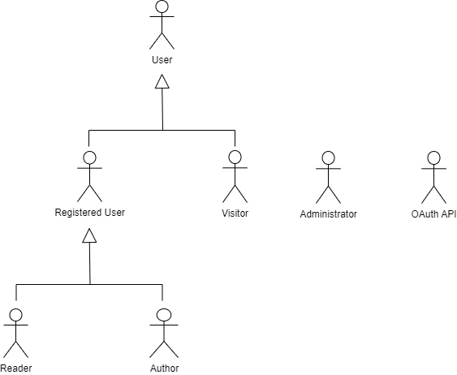
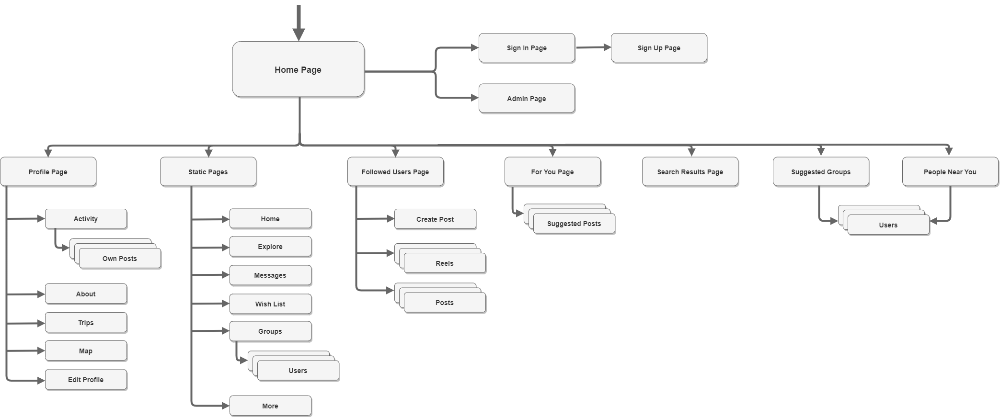
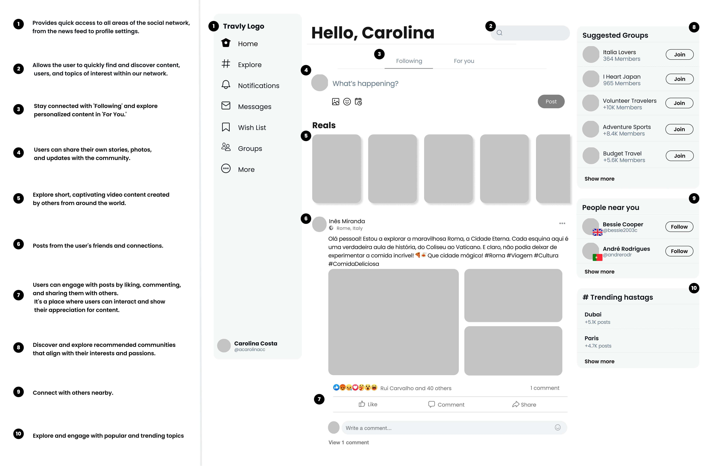
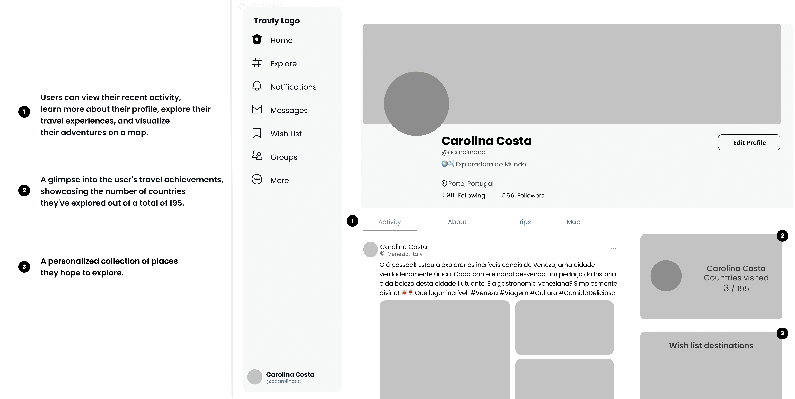
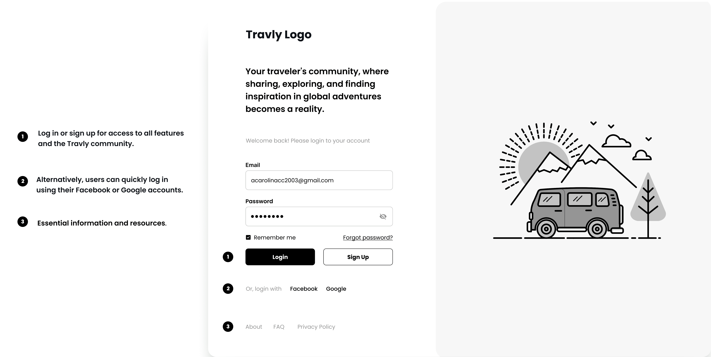

# ER: Requirements Specification Component

**Connecting the World, One Adventure at a Time.**

Travly is a platform designed to unite passionate travelers, allowing them to authentically share their adventures, connect with fellow wanderers and explore the world together.

## A1: Travly

In the current scenario, where digital connectivity has become an essential part of everyday life, we present Travly, an innovative social network dedicated to travelers. This project arises from our passion for exploring new horizons and the desire to create meaningful connections with other travel enthusiasts.

Travly emerges from our realization that travel stories often get lost on conventional social media platforms, unable to capture the richness of travel experiences. We are driven to provide a space where travelers can share their journeys authentically, enriched with unique details, while connecting with other travel enthusiasts and forming genuine bonds.

With the ability to share engaging travel photos and stories, write about visited destinations, and create personalized travel lists, users have at their disposal a dynamic platform that not only allows for documenting and sharing adventures but also promotes interaction and inspiration within the community, always ensuring user management and administration to guarantee privacy and security for all. Users have control over who can see their information and posts, thus protecting their privacy. Users also have the opportunity to follow other travelers, express appreciation through "likes," and engage in discussions through comments on posts.

Furthermore, we are committed to providing advanced search features to help users discover new destinations and experiences according to their personal interests.

We offer easy registration through email or social media, promoting accessibility. Additionally, each user can customize their profile with personal information and images to showcase their individuality.

Users are divided into groups with different permissions. These groups include **administrators** with full access and modification privileges, **registered users** with an active account, enabling them to utilize additional features and engage on the social network, **users** who can access public information, such as user accounts and posts, **visitors** who are unregistered users who can either create an account or log in to an existing one and a **reader** that is a user that can interact with posts created by **authors**.

---

## A2: Actors and User stories

This UML diagram allows us to better understand the types of users that will use our app. From registered users (who are already logged in into the social network and with access to public stuff) and visitors (users who don´t have an account yet) all the way up to administrators (who have complete control over everything), the social network will count with various types of users.

### 1\. Actors

> In order to define the roles and participants in our project, we will first introduce the concept of "Actors." This includes a diagram that identifies actors and their relationships, as well as a table providing brief descriptions of each actor's role and responsibilities.

| Identifier | Description |
|---|---|
| User  | Basic user, can look up public information like accounts and posts. |
| Visitor | User without account, can create an account or log on to an existing one. |
| Registered User | User with an account. Can input and access information, request and return individual items, leave comments on items as well as rate them. |
| Reader | Authenticated user that is seeing a post. Can share and rate posts and also comment on them. |
| Author | Authenticated user and creator of a post. Can edit, hide or delete their own posts. |
| Administrator | Authenticated user responsible for managing and moderating the activity of other users. |
| OAuth API | API used to register and authenticate users. |

### 2\. User Stories

> User stories organized by actor.  
> For each actor, a table containing a line for each user story, and for each user story: an identifier, a name, a priority, and a description (following the recommended pattern).

#### 2.1. User
| Identifier | Name | Priority | Description |
| ------ | ------ | ------ | ------ |
|   US01   |   See Home   |  High  | As a User, I want to access the Home page, so that I can see a brief presentation of the website. |
|   US02   |   See About   |  High  | As a User, I want to access the About page, so that I can see a brief description of the website, its functionalities and its creators. |
|   US03   |   See Help    |  High  | As a User, I want to access the Help page, so that I can get help or clarify any doubt. |
|   US04   |   See Privacy Policy   | High | As a User, I would like to access the Privacy Policy page, so that I can review the terms and guidelines, gaining a better understanding of how my information is handled and ensuring transparency in data privacy practices. |
|   US05   |   See FAQ   | High | As a User, I would like to access the FAQ page, so that I can view common questions and find answers to clarify any doubts I may have. |

#### 2.2. Visitor
| Identifier | Name | Priority | Description |
| ------ | ------ | ------ | ------ |
|   US06   |   Sign-up   |  High  | As a Visitor, I want to sign up for the system, so that I can enable myself to authenticate and access its features. |
|   US07   |   Sign-in   |  High  | As a Visitor, I want to authenticate into the system, so that I can access more features. |
|   US08   |   OAuth API Sign-up    |  Low  | As a Visitor, I want to register a new account linked to my Google or Facebook account, so that I do not need to create a whole new account to use the platform. |
|   US09   |   OAuth API Sign-in | Low | As a Visitor, I want to sign-in through my Google or Facebook account, so that I can authenticate myself into the system. |

#### 2.3. Registered User
| Identifier | Name | Priority | Description |
| ------ | ------ | ------ | ------ |
|   US10   |   See Following   |  High  | As a Registered User, I want to acess my Following page, so that I can view my friend's posts. |
|   US11   |   See For You   |  High  | As a Registered User, I want to access my For You page, so that I can see posts that are of my interest. |
|   US12   |   See Profile    |  High  | As a Registered User, I want to acess my Profile page, so I can see how my feed looks. |
|   US13   |   See Explore | High | As a Registered User, I want to acess my Explore Page, so that I can see random content that might be of interest to me. |
|   US14   |   See Notifications   |  High  | As a Registered User, I want to access my Notifications, so that I can be informed about recent activities and updates related to my account and interactions. |
|   US15   |   See Messages   |  High  | As a Registered User, I want to access the Messages page, so that I can see all my conversations. |
|   US16   |   See Wish List   |  High  | As a Registered User, I want to access my Wish List, so that I can browse through posts featuring places and experiences I enjoy. |
|   US17   |   See Groups   |  High  | As a Registered User, I want to view my Groups, so that I can easily get a brief overview of the groups I'm in. |
|   US18   |   Message   |  High  | As a Registered User, I want to send messages, so that I can talk with the people I follow. |
|   US19   |   Search profile   |  High  | As a Registered User, I want to search for other users, so that, if their profile is public, I can view it. |
|   US20   |   Friend´s Request   |  High  | As a Registered User, I want to send friend’s requests, so that I can follow private accounts. |
|   US21   |   Private Profile   |  High  | As a Registered User, I want to keep my account private, so that I can decide who can follow me.  |
|   US22   |   Edit Profile   |  High  | As a Registered User, I want to edit my profile, so that I can have it always the way I like and updated. |
|   US23   |   Countries Visited   |  High  | As a Registered User, I want to show the countries I've visited on my profile, so that I can provide a visual record for myself and visitors to see. |
|   US24   |   See Suggested Groups   |  Medium  | As a Registered User, I want to see Suggested Groups, so that I can join groups of my interest. |
|   US25   |   See People Near You  |  Low  | As a Registered User, I want to see people nearby, so that I can get in contact with people visiting the same places as me. |
|   US26   |   See Trending Hashtags   |  Medium  | As a Registered User, I want to see Trending Hashtags, so that I can stay updated on popular topics. |

#### 2.3. Reader
| Identifier | Name | Priority | Description |
| ------ | ------ | ------ | ------ |
|   US27   |   Comment   |  High  | As a Reader, I want to comment publications, so that I can leave an opinion or response to the publication. |
|   US28   |   React   |  High  | As a Reader, I want to react to publications, so that I can express my reaction to the post. |
|   US29   |   Share    |  High  | As a Reader, I want to share posts, so that I can show them to my friends. |
|   US30   |   Add to Wish List | High | As a Reader, I want to add posts of places and experiences of my interest to my wish list so that I can easily access them later. |

#### 2.3. Author
| Identifier | Name | Priority | Description |
| ------ | ------ | ------ | ------ |
|   US31   |   Post Picture and/or Video   |  High  | As an Author, I want to access my gallery, so that I can post one or more pictures/videos from it. |
|   US32   |   Post Text   |  High  | As a Author, I want to post text, so that I can write and share my thoughts. |
|   US33   |   Hashtag   |  High  | As an Author, I want to write hashtags in my posts, so that I can increase visibility and connect with a wider audience interested in similar topics.|
|   US34   |   Location   |  High  | As an Author, I want to show the location of my post, so that I can provide context and share where the experience took place. |
|   US35   |   Respond Comment    |  High  | As an Author, I want to respond to comments on my posts, so that I can engage with my friends and readers. |
|   US36   |   Delete Comment    |  High  | As an Author, I want to be able to delete any comment that I don´t like, so that I don't have any desnecessary comment. |
|   US37   |   Delete Post | High | As an Author, I want to be able to delete my posts, so that I can remove unintentional or disliked content. |

#### 2.3. Administrator
| Identifier | Name | Priority | Description |
| ------ | ------ | ------ | ------ |
|   US38   |   Remove Comments   |  High  | As an Admin, I want to remove a comment, so that I can remove inappropriate content. |
|   US39   |   Accept User   |  High  | As an Admin, I want to approve new user's registrations, so that I can grant him/her access to restricted content.|
|   US40   |   Ban User    |  High  | As an Admin, I want to restrict a user's access to the system, so that I can ensure they can no longer reach restricted content on the site. 

### 3\. Supplementary Requirements

> To complement the core project requirements, we introduce the Supplementary Requirements, which encompass additional details and specifications essential to the successful execution of our project.

#### 3.1. Business rules

| Identifier | Name | Description |
| :---         |     :---:      |          ---: |
| BR01   | User Registration     | Only registered users can create accounts on Travly. There should be an option for registration using email or social media accounts. Personal information provided during registration must be protected and treated confidentially.    |
| BR02     | User Profiles       | Each user can customize their profile with personal information, images, and interests. Users can choose who can see the information on their profile (public, friends, private). User's personal information must be protected against unauthorized access.      |
| BR03   | User Interaction     | Users can follow other users to track their activities. Users can express appreciation for posts through "likes." Comments on posts should be available to encourage discussion. Users cannot send offensive messages or inappropriate content.    |
| BR04     | Privacy and Security       | Administrators are responsible for monitoring and moderating content to ensure safety and prevent privacy violations. User passwords must be protected with robust security measures, such as hashing and salting.      |
| BR05   | Content Management     | Users can create, edit, and delete their own posts.    |
| BR06     | Age Restrictions       | Users must meet a minimum age requirement to create accounts on Travly, in accordance with child protection laws.      |
| BR07   | Copyright and Intellectual Property     | Users cannot upload copyrighted content without proper permission. Copyright infringement must be addressed with appropriate measures, such as content removal.    |
| BR08     | Reporting and Abuse Management       | Users must have the ability to report abusive content or behavior.      |
| BR09   | Data Backup and Recovery     | A regular backup system must be implemented to ensure data recovery in case of failures or losses.    |
| BR10     | Self-Liking       | Users cannot like their own posts or comments.      |
| BR11   | Self-Commenting     | Users can comment on their own posts or replies/comments.    |
| BR12     | Stories and Posts       | Posts and content shared by a deleted user will be marked as "removed by the user" instead of being completely deleted. This helps maintain the integrity of conversations and experiences shared with other users.      |
| BR13   | Comments and Ratings     | Comments and likes made by a deleted user on other posts will remain visible, but the user's name will be changed to a generic identifier, preserving privacy.    |
| BR14     | Personal Data       | Any personal data and profile information associated with a deleted user's account will be completely removed and deleted from our systems, ensuring compliance with privacy regulations.      |
| BR15   | Friends and Followers     | The friendship or follower relationship between the deleted user and other users will be terminated, preserving the privacy of the remaining users.    |
| BR16     | Custom Travel List       | Any custom travel list created by the deleted user will be dissociated from the account but will remain available to other users.      |
| BR17   | Activity Log     | An activity log will be maintained for audit purposes, indicating that the deleted user chose to delete the account and the actions performed during the operation.    |
| BR18     | Future Restrictions       | The deleted user cannot create a new account with the same email address or username for a specific period after the deletion of the original account to prevent system abuse.      |
| BR19   | Comment Posting Date after Travel Date     | Comments related to a trip can only be posted after the travel date. This prevents users from commenting on trips that have not yet been shared on the platform.    |
| BR20     | Restriction on Updating Past Dates       | Users cannot update the dates of past trips. This maintains the integrity of historical travel information.      |

#### 3.2. Technical requirements

| Identifier | Name | Description |
| :---         |     :---:      |          ---: |
| TR01   | Server Infrastructure     | Ensure robust and scalable servers to handle the traffic and data generated by the Travly community.    |
| TR02     | Data Storage       | Implement reliable and scalable storage solutions to accommodate user photos, videos, and other content.      |
| TR03   | Redundancy     | Configure hardware redundancy to minimize downtime and ensure high availability.    |
| TR04     | Database       | Utilize an efficient database management system to store and retrieve user information, content, and interactions.      |
| TR05   | Application Security     | Implement security measures to protect data in transit and ensure secure authentication for users.    |
| TR06     | Authentication and Authorization       | Implement a strong authentication system to ensure that only authorized users have access to Travly.      |
| TR07   | Backup and Recovery     | Perform regular backups of user data and implement a disaster recovery plan to ensure service continuity in case of failures.    |
| TR08     | Ethics       | The Travly system must adhere to ethical principles in software development. This includes protecting user information and ensuring that personal data is not collected or shared without proper authorization from the owners.      |
| TR09   | Usability     | Usability is crucial for the success of Travly. The system should be intuitively designed with a user-friendly interface so that users of all ages and technical experience levels can use it without difficulty.    |
| **TR10**     | **Scalability to Handle a Large Number of Users**        | **Importance: Scalability is essential because Travly's success depends on the number of active users and the volume of data generated. The application must be able to handle traffic spikes and constant user growth. Justification: As the Travly community grows, server infrastructure and processing capacity must be effectively scaled to ensure fast and stable performance. This will ensure that users have a satisfactory experience regardless of the amount of traffic on the platform.**      |
| **TR11**   | **Data Security and User Privacy**     | **Importance: Data security and user privacy are critical, considering that personal information and sensitive data are shared on the platform. Security breaches can affect user trust and Travly's reputation. Justification: Implementing robust security measures, such as data encryption, secure authentication, and access control, is crucial to protect user information.**    |
| **TR12**     | **Integration with Social Media Platforms and Third-Party Authentication**       | **Importance: Integration with social media platforms simplifies user registration and login, making the process more accessible and appealing. Additionally, integration with other external services can enhance the user experience. Justification: Many users prefer the convenience of logging in with their existing social media accounts rather than creating new credentials. Furthermore, integration with third-party APIs, such as mapping services, can enrich Travly's functionality, allowing users to explore and plan trips more effectively.**      |

#### 3.3. Restrictions

| Identifier | Name | Description |
| :---         |     :---:      |          ---: |
| C01   | Budget     | The development and operation of Travly are subject to budget constraints.    |
| C02     | Legal and Privacy Regulations       | Travly must comply with all applicable legal and privacy regulations. This includes compliance with data protection laws, copyrights, and any other regulations related to social networks and online content sharing. Additionally, it must adhere to specific travel and tourism regulations when applicable.      |
| C03   | Integration with Other Platforms     | Travly may seek integrations with other third-party platforms or services, such as social media or mapping services. Any integration must be done in accordance with the policies and terms of use of these platforms and must remain compliant with any updates or changes to these policies.    |
| C04     | Intellectual Property        | All images, texts, and content shared by users on Travly must comply with intellectual property laws. This includes copyrights and image rights. Any copyrighted content must be used with proper permission or as allowed by law.      |
| C05   | Deadline     | The project is subject to a defined academic timeframe. All development, testing, and documentation activities must be completed within this timeframe.    |

---

## A3: Information Architecture

> This artifact provides a concise glimpse into the information architecture of the upcoming system. Its objectives encompass:
Facilitating the identification and description of user requirements, while also prompting the discovery of potential new requirements.
Offering a preliminary and empirical evaluation of the user interface for the forthcoming product.
Enabling rapid, iterative design improvements to the user interface.
This document consists of two key components:
A sitemap that outlines the structure for organizing information across various pages.
A series of wireframes that delineate the functionality and content for each page. These wireframes are crafted for a minimum of two of the most pivotal pages.

### 1\. Sitemap

> Sitemap presenting the overall structure of our social network.  

### 2\. Wireframes

> Explore the visual of our project through these wireframes, offering a sneak peek into the design and functionality of our Home, User Profile, and Landing Page.

#### UI01: Home

#### UI02: User Profile

#### UI03: Landing Page

---

## Revision history

Changes made to the first submission:

So far, there haven't been any previous submissions.

---

GROUP2334, 01/10/2023

* Ana Carolina Coutinho, up202108685@fe.up.pt (Editor)
* Maria Inês Miranda, up202108775@up.pt
* Rui Carvalho, up202108807@fe.up.pt
* André Rodrigues, up202108721@fe.up.pt