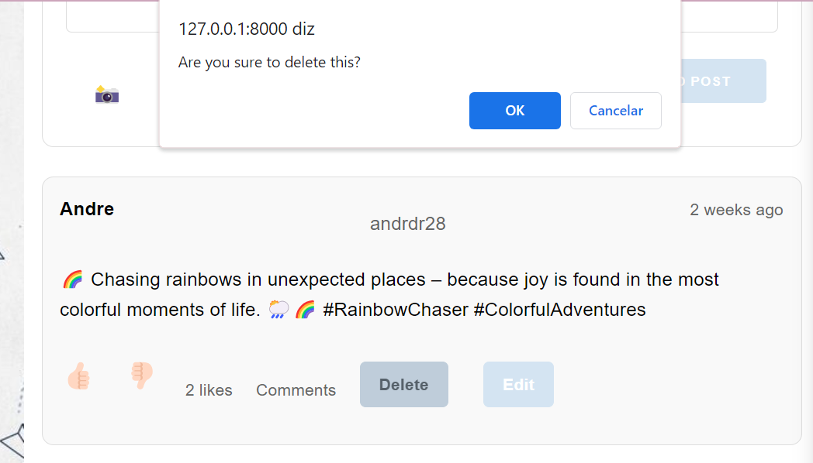
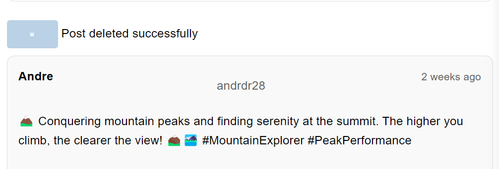
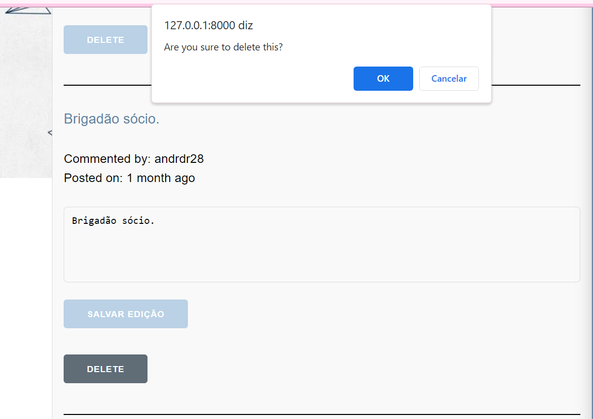
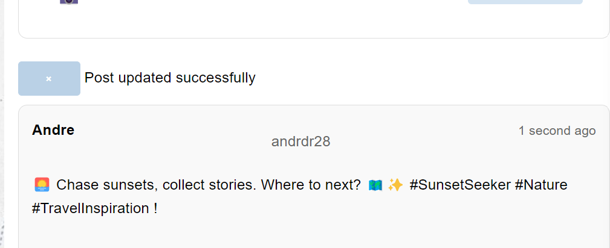

# PA: Product and Presentation

## A9: Product

 The final creation of Travly is a testament to the innovative development of a unique social network tailored specifically for avid travelers. This platform is crafted using advanced technologies such as PHP and the Laravel Framework, ensuring dynamic and engaging web pages. To enhance user interaction, AJAX is employed, providing a seamless and responsive user experience. The backbone of Travly is its robust PostgreSQL database, ensuring reliable and efficient data management.

 Travly's core mission is to forge a vibrant community of travelers, enabling them to connect, share, and discover. It's more than just a social network; it's a gateway to a world of exploration and cultural exchange. Upon registering and verifying their identity, users can dive into a rich tapestry of travel experiences, stories, and tips. Travly stands as a beacon for travel enthusiasts, offering a platform where journeys are shared, experiences are amplified, and the world becomes a little closer for everyone.

### 1. Installation

 The release with the final version of the source code in the group's Git repository is available here, in PA tag.

 Full Docker command to launch the image available in the group's GitLab Container Registry using the production database:

docker run -it -p 8000:80 --name=lbaw2334 -e DB_DATABASE="lbaw2334" -e DB_SCHEMA="lbaw2334" -e DB_USERNAME="lbaw2334" -e DB_PASSWORD="CkpWmrii" git.fe.up.pt:5050/lbaw/lbaw2324/lbaw2334

### 2. Usage

> The final product is available online on https://lbaw2334.lbaw.fe.up.pt/

#### 2.1. Administration Credentials

| Email | Password | Username |
| -------- | -------- | -------- |
| andr28@gmail.com    | my_vip_account | andrdr28 |

#### 2.2. User Credentials

| Type          | Username  | Password |
| ------------- | --------- | -------- |
| georgekatie350@test.com | georgekatie    | 123teste_cool |
| alicewendy126@gmail.com | alicewendy    | 123teste_cool |

### 3. Application Help

> In our application, help features are seamlessly integrated alongside the main functionalities. These features are designed to provide guidance and improve user experience, manifesting in various forms like alert messages for certain actions and informative static pages.

**Static Pages**: Users can access helpful resources such as the "Help", "FAQ", "Privacy Policy" and "About" pages. These pages are reachable through their respective URL paths ("/help", "/about", "/faq", "/privacy-policy") or by clicking dedicated buttons in the topbar.

_About Page_: Introduces Travly, highlighting its mission to connect travelers worldwide, its founding story, the team behind it, and the core values driving the community.

_Help Page_: Offers user support for Travly, featuring guides on how to use the platform, tips for networking with fellow travelers, and solutions to common technical issues.

_FAQ Page_: Answers frequently asked questions about Travly, covering topics like creating and managing profiles, finding travel companions, sharing experiences, and using social features.

_Privacy Policy Page_: Details how Travly handles user data, including information on data collection, usage, security measures, and user privacy rights, ensuring transparency and trust.

**Alert Messages**
Implementation: Alert messages are used to notify users about the outcome of various actions, such as creating posts or comments, forming groups, and important confirmations like deleting a group or an account.

Examples: These include success messages following certain actions and confirmation messages for significant actions like deleting a group or account.

**Delete Post**

**Post Deleted**

**Delete Comment**

**Post Updated**

### 4. Input Validation

We implemented back-end input validation using Illuminate\Http\Request, which provides access to a "validate" function with various validation options. This functionality was applied to validate inputs in our forms, such as the login/register form and the edit group/user profile forms. The following examples illustrate how we utilized this feature:

**Login**

**Register**

**Edit Profile**

### 5. Check Accessibility and Usability

> Accessibility: 17/18  
> Usability: 24/28 

### 6. HTML & CSS Validation
 
> HTML: 
 
- https://git.fe.up.pt/lbaw/lbaw2324/lbaw2334/-/blob/main/public/Docs/Showing%20results%20for%20explore.blade.php%20-%20Nu%20Html%20Checker.pdf?ref_type=heads

- https://git.fe.up.pt/lbaw/lbaw2324/lbaw2334/-/blob/main/public/Docs/Showing%20results%20for%20groups.blade.php%20-%20Nu%20Html%20Checker.pdf?ref_type=heads

- https://git.fe.up.pt/lbaw/lbaw2324/lbaw2334/-/blob/main/public/Docs/Showing%20results%20for%20home.blade.php%20-%20Nu%20Html%20Checker.pdf?ref_type=heads

- https://git.fe.up.pt/lbaw/lbaw2324/lbaw2334/-/blob/main/public/Docs/Showing%20results%20for%20notifications.blade.php%20-%20Nu%20Html%20Checker.pdf?ref_type=heads

- https://git.fe.up.pt/lbaw/lbaw2324/lbaw2334/-/blob/main/public/Docs/Showing%20results%20for%20profile.blade.php%20-%20Nu%20Html%20Checker.pdf?ref_type=heads
 
> CSS:  

- https://git.fe.up.pt/lbaw/lbaw2324/lbaw2334/-/blob/main/public/Docs/Resultados%20da%20valida%C3%A7%C3%A3o%20CSS%20do%20W3C%20para%20dashboard.css%20(CSS%20n%C3%ADvel%203%20+%20SVG).pdf?ref_type=heads

- https://git.fe.up.pt/lbaw/lbaw2324/lbaw2334/-/blob/main/public/Docs/Resultados%20da%20valida%C3%A7%C3%A3o%20CSS%20do%20W3C%20para%20explore.css%20(CSS%20n%C3%ADvel%203%20+%20SVG).pdf?ref_type=heads

- https://git.fe.up.pt/lbaw/lbaw2324/lbaw2334/-/blob/main/public/Docs/Resultados%20da%20valida%C3%A7%C3%A3o%20CSS%20do%20W3C%20para%20groups.css%20(CSS%20n%C3%ADvel%203%20+%20SVG).pdf?ref_type=heads

- https://git.fe.up.pt/lbaw/lbaw2324/lbaw2334/-/blob/main/public/Docs/Resultados%20da%20valida%C3%A7%C3%A3o%20CSS%20do%20W3C%20para%20home.css%20(CSS%20n%C3%ADvel%203%20+%20SVG).pdf?ref_type=heads

- https://git.fe.up.pt/lbaw/lbaw2324/lbaw2334/-/blob/main/public/Docs/Resultados%20da%20valida%C3%A7%C3%A3o%20CSS%20do%20W3C%20para%20profile.css%20(CSS%20n%C3%ADvel%203%20+%20SVG).pdf?ref_type=heads

### 7. Revisions to the Project

> Since the requirements specification stage, we made some modifications, more specifically to the database.

**Database schema**
- 6 new attributes added to the user_ table: description_, location, countries_visited, header_picture, profile_picture and remember_token;
- 1 attribute added to the post_ table: groupID;
- 1 attribute added to the notification_ table: seen;

**User Stories**
- **Visitor:** as a visitor (unauthenticated user), I want to be able to *recover my password*, in case I forget what it is.
- **Registered User:** as a registered user, I want to *see who I am following*, as well as *who is following me*, so that I can see other users' posts and keep track of the users that have access to my posts.
- **Author:** as an author of a post or comment, I want be able to *edit* them in case I write something wrong, or upload the wrong image.
- **Admin:** as an admin, I have *control over everyone and everything*. Thus, if I consider that something went against Travly's privacy policy, I can consider *deleting posts and comments*, and in the last case, *banning the user*.

**Web Resources Specification**

Here, we present some of the most important routes defined in the project, among many others that are equally important in order to have the app fully functional. 

*Authentication*
| Web Resource Implementation | URL  |
| ----------------- | ----------- |
| Login Form | GET /login  |
| Login Action | POST /login  |
| Logout Action | GET /logout |
| Register Form | GET /register |
| Register Action | POST /register |
| Send Email Form | GET /send-email |
| Reset Password Form | GET /password/reset |
| Reset Password Action | POST /password/reset |
| Send Email Action | POST /send |

*User*
| Web Resource Implementation | URL |
| ----------------- | ----------- |
| View user profile | GET /profile/show/{id}  |
| Edit user profile | GET /profile/edit/{id} |
| Update user profile | POST /profile/update/{id}  |
| Delete user account| GET /profile/delete/{id}  |
| Search users | GET /users/search |
| see followers | GET /{userid}/followers |
| See following | GET /{userid}/following |

*Posts*
| Web Resource Implementation | URL |
| ----------------- | ----------- |
| List posts | GET /posts |
| Create post | POST /posts/create |
| Delete post | POST /posts/delete |
| Edit post | POST /posts/edit/{id} |
| Like post | POST /posts/like |
| Search posts | GET /posts/search |

*Groups*
| Web Resource Implementation | URL |
| ----------------- | ----------- |
| List groups | GET /groups |
| Create Group Form | GET /groups/create |
| Create Group Action | GET /groups/create  |
| See specific group | GET /group/{groupid} |
| See specific group's details | GET /group/{groupid}/details |
| Add user to a specific group | GET /group/{groupid}/details/add-user/{userid} |
| Remove user from a specific group | GET /group/{groupid}/details/remove-user/{userid} |

*Static Pages*
| Web Resource Implementation | URL |
| ----------------- | ----------- |
| FAQ | GET /faq |
| ABOUT | GET /about |
| PRIVACY POLICY | GET /privacy-policy |
| HELP | GET /help |

### 8. Implementation Details

#### 8.1. Libraries Used

**Libraries and Frameworks Used**

Laravel, for server-side management
Bootstrap, for frontend responsive and intuitive 

#### 8.2 User Stories

> This subsection should include all high and medium priority user stories, sorted by order of implementation. Implementation should be sequential according to the order identified below. 
>
> If there are new user stories, also include them in this table. 
> The owner of the user story should have the name in **bold**.
> This table should be updated when a user story is completed and another one started. 

| US Identifier | Name                          | Module        | Priority | Team Members             | State |
|---------------|--------------------------------|----------------|----------|--------------------------|-------|
| US01          | See Home                       | Module Home    | High     | Ana Carolina Coutinho, Maria Inês Miranda, Rui Carvalho, André Rodrigues    | 100%  |
| US02          | See About                      | Module Info    | High     | Maria Inês Miranda    | 100%   |
| US03          | See Help                       | Module Info    | High     | Rui Carvalho          | 100%   |
| US04          | See Privacy Policy             | Module Info    | High     | André Rodrigues                        | 100%    |
| US05          | See FAQ                        | Module Info    | High     | Ana Carolina Coutinho               | 100%  |
| US06          | Sign-up                        | Module Auth    | High     | Ana Carolina Coutinho, Rui Carvalho               | 100%   |
| US07          | Sign-in                        | Module Auth    | High     | Ana Carolina Coutinho, Rui Carvalho          | 100%   |
| US08          | OAuth API Sign-up              | Module Auth    | Low      | -                        | 0%    |
| US09          | OAuth API Sign-in              | Module Auth    | Low      | -                        | 0%    |
| US10          | Recover Password               | Module Auth       | High     | Rui Carvalho         | 100%
| US11          | See Following                  | Module Social  | High     | Ana Carolina Coutinho, Rui Carvalho             | 100%  |
| US12          | See For You                    | Module Social  | High     | -                | 0%   |
| US13          | See Profile                    | Module Profile    | High     | Ana Carolina Coutinho, Maria Inês Miranda, Rui Carvalho, André Rodrigues        | 100%   |
| US14          | See Explore                    | Module Discovery  | High     | Ana Carolina Coutinho               | 100%   |
| US15          | See Notifications              | Module Social     | High     | André Rodrigues                | 100%   |
| US16          | See Messages                   | Module Messaging  | High     | Ana Carolina Coutinho         | 20%   |
| US17          | See Wish List                  | Module Social     | High     | -               | 0%   |
| US18          | See Groups                     | Module Social     | High     | Maria Inês Miranda                | 100%   |
| US19          | Message                        | Module Messaging  | High     | Ana Carolina Coutinho        | 20%   |
| US20          | Search Profile                 | Module Search     | High     | Rui Carvalho               | 100%   |
| US21          | Friend´s Request               | Module Social     | High     | André Rodrigues                | 100%   |
| US22          | Private Profile                | Module Profile    | High     | Rui Carvalho         | 100%   |
| US23          | Edit Profile                   | Module Profile    | High     | Ana Carolina Coutinho, Maria Inês Miranda, Rui Carvalho               | 100%   |
| US24          | Countries Visited              | Module Profile    | High     | Ana Carolina Coutinho, Maria Inês Miranda                | 20%   |
| US25          | See Suggested Groups           | Module Discovery  | Medium   | Ana Carolina Coutinho         | 20%   |
| US26          | See Trending Users            | Module Social     | Low      | Ana Carolina Coutinho              | 100%   |
| US27          | See Trending Hashtags          | Module Discovery  | Medium   | Ana Carolina Coutinho              | 70%   |
| US28          | Comment                        | Module Interaction| High     | Ana Carolina Coutinho,Rui Carvalho          | 100%   |
| US29          | React                          | Module Interaction| High     | Ana Carolina Coutinho               | 100%   |
| US30          | Share                          | Module Social     | High     | -                | 0%   |
| US31          | Add to Wish List               | Module Social     | High     | -          | 0%    |
| US32          | Post Picture and/or Video      | Module Content    | High     | Ana Carolina Coutinho               | 100%  |
| US33          | Post Text                      | Module Content    | High     | Ana Carolina Coutinho                | 100%   |
| US34          | Hashtag                        | Module Content    | High     | Ana Carolina Coutinho         | 100%   |
| US35          | Location                       | Module Content    | High     | Ana Carolina Coutinho             | 100%   |
| US36          | Respond Comment                | Module Interaction| High     | -                | 0%    |
| US37          | Delete Comment                 | Module Interaction| High     | Ana Carolina Coutinho          | 100%    |
| US38          | Delete Post                    | Module Content    | High     | Ana Carolina Coutinho | 100%    | 
| US39          | Remove Comments                | Module Admin      | High     | Ana Carolina Coutinho                | 100%    |
| US40          | Ban User                       | Module Admin      | High     | Ana Carolina Coutinho              | 100%    |
| US41          | Delete Post                       | Module Admin      | High     | Ana Carolina Coutinho              | 100%    |

---

## A10: Presentation
 
### 1. Product presentation

Travly is a dynamic social network designed exclusively for travelers and adventure seekers. It serves as a unique platform where individuals passionate about exploring the world can connect, share their experiences, and discover new destinations. At its core, Travly is about building a global community of travelers, providing a space where users can exchange tips, stories, and insights from their journeys, enriching the travel experience for everyone involved. Whether you're planning your next trip or reminiscing about past adventures, Travly brings the excitement and wonder of travel right to your fingertips.

Key features of Travly include personalized content feeds, where users can see posts tailored to their interests, and robust group functionalities to join or create communities based around specific travel themes or destinations. Users can maintain private profiles for personal security while still engaging with the community, and the platform's integrated messaging system allows for direct communication among users. With options to showcase countries visited, share travel wish lists, and access trending travel hashtags, Travly is not just a social network — it's a comprehensive travel companion that caters to all aspects of the travel enthusiast's lifestyle.

URL to the product: https://lbaw2334.lbaw.fe.up.pt

### 2. Video presentation

> https://git.fe.up.pt/lbaw/lbaw2324/lbaw2334/-/blob/main/public/Docs/clideo_editor_50985c906369440d8d5c628aab3d90a7.mp4?ref_type=heads

---

## Revision history

Changes Made to the First Submission:

**Completed Social Interaction Features**: Achieved full implementation of 'See Following', 'See Notifications', 'Friend's Request', and 'See Trending Users' in the Social Module, enhancing user networking and interaction.

**Profile and Discovery Modules**: Fully developed 'See Profile', 'See Explore', and 'Search Profile', allowing users to manage their profiles and explore tailored content effectively.

**Content Creation and Engagement**: Completed the ability to post pictures/videos, text, utilize hashtags, and manage comments (respond to and delete) in the Content and Interaction Modules.

**Advanced Administrative Controls**: Achieved full functionality in Admin Module with the implementation of 'Remove Comments' and 'Ban User', ensuring a safe community environment.

**Development of Innovative Features**: Partial implementation of 'See Suggested Groups' and 'See Trending Hashtags', showcasing ongoing innovation and platform enhancement.

**Enhanced User Interaction Capabilities**: Ensured seamless user engagement with fully completed features like 'Comment', 'React', and 'Share' in the Interaction Module.

**Robust Content Management**: Enabled users to control their content through complete development of 'Post Picture and/or Video', 'Post Text', 'Hashtag', 'Location', 'Delete Comment', and 'Delete Post' features.

***
GROUP2334, 21/12/2023

* Ana Carolina Coutinho, [up202108685@fe.up.pt](mailto:up202108685@fe.up.pt) (Editor)
* Maria Inês Miranda, [up202108775@up.pt](mailto:up202108775@up.pt)
* Rui Carvalho, [up202108807@fe.up.pt](mailto:up202108807@fe.up.pt)
* André Rodrigues, [up202108721@fe.up.pt](mailto:up202108721@fe.up.pt)-